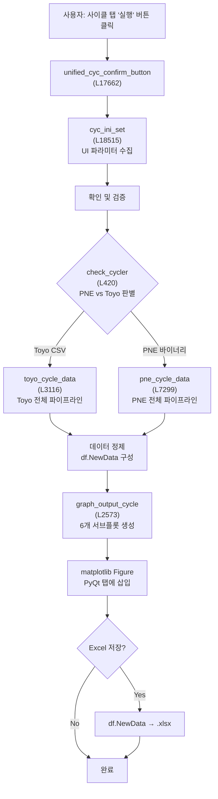

# 사이클 데이터 파이프라인 전체 흐름 (Overview)

> **학습 목표**: BDT의 **사이클 데이터 로드 → 변환 → 그래프 출력** 전체 과정을 이해한다.
> 22,000줄 모놀리식 코드에서 사이클 탭의 핵심 흐름을 추적하고, 
> 함수 간 데이터 전달 구조와 PyQt6 신호 연결을 체화한다.

---

## 1. 전체 데이터 흐름도 (Mermaid)



---

## 2. 함수 호출 계층도 & 라인 위치

### 최상위 진입점

```
unified_cyc_confirm_button (L17662) [WindowClass 메서드]
│
├─ 신호: cycle_confirm QPushButton clicked
├─ 역할: 메인 UI 핸들러, 전체 파이프라인 오케스트레이션
└─ 에러 처리: try-except로 예외 캡처, QMessageBox.critical로 사용자 표시
```

### 1단계: UI 파라미터 수집

```
cyc_ini_set (L18515)
├─ 역할: 사이클 탭의 모든 입력 위젯에서 값 읽기
├─ 반환값:
│  ├─ 경로, 채널, 사이클 번호 범위
│  ├─ 용량 설정 (mincapacity, inirate/ini_crate)
│  ├─ DCIR 모드 (chkir, chkir2, mkdcir)
│  └─ 그래프 옵션 (xscale, ylimit, color scheme)
└─ UI 위젯: cycle_path_table, ratetext, dcirchk/pulsedcir/mkdcir, etc.
```

### 2단계: 충방전기 타입 판별

```
check_cycler (L420)
├─ 입력: raw_file_path (사이클 데이터 폴더 경로)
├─ 판별 로직:
│  ├─ [Toyo] capacity.log 존재 여부 확인
│  └─ [PNE] SaveEndData.csv 또는 바이너리 .cyc 파일 존재
├─ 반환값: 'TOYO' 또는 'PNE' (str)
└─ 예: "C:/Rawdata/TOYO1/20260319/" → 'TOYO'
        "C:/Rawdata/PNE1/20260319/" → 'PNE'
```

### 3단계: Toyo 파이프라인

```
toyo_cycle_data (L3116) [선택지 1: Toyo 충방전기]
├─ 입력:
│  ├─ raw_file_path: 데이터 폴더
│  ├─ mincapacity: 최소 용량 임계값 (mAh)
│  ├─ inirate: 공칭 용량 C-rate
│  └─ chkir: DCIR 계산 모드
├─ 호출 순서:
│  ├─ 1️⃣ toyo_min_cap (L3099) — 공칭 용량 산정
│  │   └─ toyo_read_csv (L3044) — capacity.log 읽기
│  │       └─ 저장소: c:/rawdata/.../capacity.log (CSV 형식)
│  ├─ 2️⃣ toyo_cycle_import (L3084) — CSV 데이터 로드
│  │   └─ .ptn 패턴 파일 분석, 스텝 정보 추출
│  ├─ 3️⃣ 데이터 변환 (DataFrame 구성)
│  │   └─ 전압(V) × 전류(mA) × 시간 통합 → 용량/에너지
│  └─ 4️⃣ 반환: df.NewData (최종 DataFrame)
│
└─ 주의: 외부 DCIR 파일 (cycle별) 필요 — 폴더 내 DCIR_*.csv 탐색
```

### 4단계: PNE 파이프라인

```
pne_cycle_data (L7299) [선택지 2: PNE 충방전기]
├─ 입력:
│  ├─ raw_file_path: 데이터 폴더
│  ├─ mincapacity: 최소 용량 임계값 (mAh)
│  ├─ ini_crate: 공칭 용량 C-rate
│  ├─ chkir: 일반 DCIR 모드
│  ├─ chkir2: Pulse DCIR 모드
│  └─ mkdcir: MK DCIR 모드
├─ 호출 순서:
│  ├─ 1️⃣ pne_min_cap (L7147) — 공칭 용량 산정
│  │   └─ SaveEndData.csv의 'imp' 등 컬럼 분석
│  ├─ 2️⃣ _cached_pne_restore_files (L900) — SaveEndData.csv 캐시 로드
│  │   └─ 바이너리 .cyc → CSV 복원 (1회만, 이후 캐시)
│  ├─ 3️⃣ _get_pne_cycle_map (L5794) — 논리사이클 ↔ 실사이클 매핑
│  │   └─ .sch 파일 분석, cycle_map dict 구성
│  ├─ 4️⃣ _process_pne_cycleraw (L6874) — 핵심 데이터 변환
│  │   ├─ 단위 변환: μV → V, μA → mA, μAh → mAh
│  │   ├─ DCIR 3가지 모드 선택적 계산
│  │   └─ 데이터 통합
│  └─ 5️⃣ 반환: df.NewData (최종 DataFrame)
│
└─ 주의: SaveEndData.csv 구조 복잡 — 다양한 파라미터 컬럼 포함
```

### 5단계: 그래프 출력

```
graph_output_cycle (L2573)
├─ 입력: df.NewData + 그래프 옵션 (xscale, ylimit, colors, etc.)
├─ 역할: 6개 서브플롯 생성
│  ├─ [0,0] 용량/효율 추이 (Capacity, Eff, Eff2)
│  ├─ [0,1] DCIR 추이 (dcir, dcir2, soc70_dcir)
│  ├─ [0,2] 평균 전압 (AvgV) 추이
│  ├─ [1,0] 평균 온도 (Temp) 추이
│  ├─ [1,1] 에너지 (DchgEng) 추이
│  └─ [1,2] 휴지 전압 (RndV) 추이
├─ 반환: matplotlib Figure 객체
└─ PyQt 통합: FigureCanvas로 변환, 탭에 addWidget
```

---

## 3. 함수 호출 계층 (트리 형식)

```
unified_cyc_confirm_button
│
├─ cyc_ini_set()
│  └─ [UI 위젯 값 수집]
│
├─ check_cycler(raw_file_path)
│  └─ [파일 타입 판별]
│
├─ [조건부 분기]
│
├─ IF Toyo:
│  └─ toyo_cycle_data(raw_file_path, mincapacity, inirate, chkir)
│     ├─ toyo_min_cap(raw_file_path, mincapacity, inirate)
│     │  └─ toyo_read_csv() → capacity.log 로드
│     ├─ toyo_cycle_import(raw_file_path)
│     │  └─ .ptn 패턴 파일 분석
│     ├─ [단위 변환 & DataFrame 구성]
│     └─ return df.NewData
│
├─ IF PNE:
│  └─ pne_cycle_data(raw_file_path, mincapacity, ini_crate, chkir, chkir2, mkdcir)
│     ├─ pne_min_cap(raw_file_path, mincapacity, ini_crate)
│     │  └─ SaveEndData.csv 분석
│     ├─ _cached_pne_restore_files(raw_file_path)
│     │  └─ 바이너리 → CSV 캐시 로드
│     ├─ _get_pne_cycle_map(raw_file_path, ...)
│     │  └─ .sch 분석
│     ├─ _process_pne_cycleraw(...)
│     │  ├─ 단위 변환 (μ → 표준)
│     │  ├─ DCIR 모드 선택
│     │  └─ DataFrame 구성
│     └─ return df.NewData
│
├─ graph_output_cycle(df, xscale, ylimit, ...)
│  ├─ 6개 서브플롯 생성
│  ├─ THEME 색상 적용
│  └─ return fig
│
├─ [matplotlib Figure → FigureCanvas 변환]
├─ cycle_tab.addTab(canvas, f"Run {n}")
│
└─ [Excel 저장 여부]
   └─ df.to_excel(...) [선택사항]
```

---

## 4. df.NewData DataFrame 구조

> **df.NewData는 사이클 데이터 파이프라인의 핵심 산출물이다.**
> 모든 그래프는 이 DataFrame의 컬럼으로부터 생성된다.

| 컬럼명                 | 타입    | 물리적 의미          | 계산식                                | 단위  | 범위 예시        |
| ------------------- | ----- | --------------- | ---------------------------------- | --- | ------------ |
| **Cycle**           | int   | 사이클 순번          | 1, 2, 3, ...                       | -   | 1 ~ 5000     |
| **Dchg**            | float | 방전 용량 비율        | 방전용량(mAh) / 공칭용량                   | 무차원 | 0.95 ~ 1.02  |
| **Chg**             | float | 충전 용량 비율        | 충전용량(mAh) / 공칭용량                   | 무차원 | 0.96 ~ 1.03  |
| **Eff**             | float | 쿨롱효율            | Dchg / Chg (같은 사이클)                | %   | 99.5 ~ 100.0 |
| **Eff2**            | float | 교차 쿨롱효율         | Chg(n+1) / Dchg(n)                 | %   | 99.8 ~ 100.1 |
| **RndV**            | float | 충전 후 휴지 전압      | 충전 후 충분한 휴지 기간 종료 시 전압             | V   | 4.15 ~ 4.28  |
| **Temp**            | float | 최대 온도 (사이클 중)   | max(온도 기록)                         | °C  | 15 ~ 45      |
| **AvgV**            | float | 평균 방전 전압        | 방전에너지 / 방전용량                       | V   | 3.50 ~ 3.85  |
| **DchgEng**         | float | 방전 에너지          | ∫V(t)·I(t) dt (방전)                 | mWh | 8000 ~ 12000 |
| **OriCyc**          | int   | 원본 사이클 번호       | 논리사이클 → 실사이클 매핑 (PNE) / 그대로 (Toyo) | -   | 1 ~ 5000     |
| **dcir** (일반 DCIR)  | float | DC 내부저항 (정상상태)  | ΔV_ss / I_pulse (펄스 끝까지)           | mΩ  | 5 ~ 200      |
| **dcir2** (1초 DCIR) | float | DC 내부저항 (1초 시점) | (V_1s - V_0s) / I_pulse            | mΩ  | 3 ~ 150      |
| **soc70_dcir**      | float | SOC 70% DCIR    | SOC ≈ 70%에서 dcir2                  | mΩ  | 2 ~ 100      |
| **ChgVolt**         | float | 충전 상한 전압        | max(충전 중 전압)                       | V   | 4.20 ~ 4.35  |
| **ChgSteps**        | int   | 충전 스텝 개수        | CC → CV 구분, 스텝 수                   | 개   | 2 ~ 10       |

### 주요 컬럼 관계식 (물리적 의미)

```python
# 용량 & 효율
Eff = Dchg / Chg  # 같은 사이클의 방전/충전 용량 비율
Eff2 = Chg[n+1] / Dchg[n]  # 이전 방전과 현재 충전 비교

# 에너지 & 전압
DchgEng = AvgV × Dchg × 공칭용량  # 방전 에너지 (Wh 단위)
AvgV = DchgEng / (Dchg × 공칭용량)  # 평균 방전 전압 (역산)

# 저장 온도 & 휴지 전압
# RndV는 OCV의 근사값 (충분한 휴지 시간 필요, 보통 ≥1시간)
# Temp는 사이클 중 최대 온도 (온도 센서 데이터)

# DCIR 계층구조
# dcir2 (1초 DCIR) < dcir (정상상태 DCIR)
# soc70_dcir은 비교 기준점 (SOC 70%에서 가장 낮음)
```

---

## 5. Toyo vs PNE 데이터 파이프라인 비교표

| 항목          | **Toyo**                         | **PNE**                                    |
| ----------- | -------------------------------- | ------------------------------------------ |
| **데이터 형식**  | CSV (capacity.log)               | 바이너리 (.cyc) → SaveEndData.csv로 복원          |
| **인코딩**     | cp949 (한글)                       | UTF-8 / 바이너리                               |
| **전압 단위**   | V (그대로 사용)                       | μV (÷1,000,000 변환)                         |
| **전류 단위**   | mA (그대로 사용)                      | μA (÷1,000,000 변환)                         |
| **용량 단위**   | mAh (그대로 사용)                     | μAh (÷1,000 변환)                            |
| **용량 산정**   | `toyo_min_cap` (capacity.log 분석) | `pne_min_cap` (SaveEndData 분석)             |
| **DCIR 소스** | 별도 외부 파일 (cycle별 CSV)            | SaveEndData.csv의 'imp' 컬럼                  |
| **DCIR 모드** | 1가지 (일반 dcir만)                   | 3가지: 일반(chkir), Pulse(chkir2), MK(mkdcir)  |
| **사이클 매핑**  | 직선적 (cycle 컬럼 그대로)               | 논리사이클 매핑 필요 (_get_pne_cycle_map)           |
| **패턴 분석**   | .ptn 파일 → 스텝 정보 추출               | .sch 파일 → 논리사이클 구조 정의                      |
| **캐싱**      | 없음 (매번 파일 읽기)                    | SaveEndData 캐시 (_cached_pne_restore_files) |
| **데이터 병합**  | 연속 동일 Condition 행 자동 merge       | pivot_table 기반 통합 (TotlCycle 기준)           |

### 데이터 형식 예시

**Toyo capacity.log (CSV)**
```
Time[s], Cycle, Condition, Voltage[V], Current[mA], Temp[°C], ...
0.0, 1, 1, 4.20, -100, 25.0, ...
1.5, 1, 1, 4.19, -100, 25.1, ...
...
```

**PNE SaveEndData.csv (복원된 바이너리)**
```
TotlCycle, Channel, Step, Time[s], Voltage[uV], Current[uA], Capacity[uAh], imp, ...
1, 1, 100, 0.0, 4200000, -100000, 1000000, 50000, ...
1, 1, 100, 1.5, 4190000, -100000, 1050000, 50100, ...
...
```

---

## 6. 핵심 개념: 데이터 흐름의 3가지 변환

### Step 1: 기계적 변환 (Unit Conversion)

```python
# Toyo: 단위 그대로
voltage_V = voltage_from_csv  # V
current_mA = current_from_csv  # mA

# PNE: μ → 표준 단위 변환
voltage_V = voltage_from_csv / 1_000_000  # μV → V
current_mA = current_from_csv / 1_000_000  # μA → mA
capacity_mAh = capacity_from_csv / 1_000  # μAh → mAh
```

### Step 2: 물리적 변환 (Integration & Aggregation)

```python
# 순간값 (V, I) → 적분 (용량, 에너지)
capacity_mAh = integral(current_mA, time_s) / 3600  # 시간 적분
energy_mWh = integral(voltage_V * current_mA, time_s) / 3600  # 전력 적분

# 사이클 단위 집계
Dchg = total_discharge_capacity / nominal_capacity
AvgV = total_discharge_energy / total_discharge_capacity
Temp = max(temperature_in_cycle)
```

### Step 3: 논리적 변환 (Mapping & Selection)

```python
# PNE: 논리사이클 → 실사이클 매핑
logical_cycle = 100  # 사용자가 보는 사이클 번호
actual_cycle = cycle_map[logical_cycle]  # 내부 실제 사이클 번호

# 파라미터 선택 (DCIR 모드)
if chkir:
    dcir_value = dcir_general  # 일반 DCIR
elif chkir2:
    dcir_value = dcir_pulse  # Pulse DCIR
elif mkdcir:
    dcir_value = dcir_mk  # MK DCIR
```

---

## 7. PyQt6 신호 연결 & UI 통합

### 신호 흐름

```python
# UI 신호: 사이클 탭 "실행" 버튼
self.cycle_confirm.clicked.connect(self.unified_cyc_confirm_button)

# unified_cyc_confirm_button 내부:
# 1. 파라미터 수집 (cyc_ini_set)
# 2. 파이프라인 실행 (check_cycler → toyo/pne_cycle_data)
# 3. 그래프 생성 (graph_output_cycle)
# 4. PyQt 통합
fig = graph_output_cycle(...)
canvas = FigureCanvas(fig)
self.cycle_tab.addTab(canvas, f"Run {run_number}")
```

### 진행 상황 표시 (Progress Bar)

```python
# BDT는 QProgressBar를 사용하여 단계별 진행 상황 표시
progress_bar.setValue(0)   # 시작
progress_bar.setValue(25)  # 파라미터 수집 완료
progress_bar.setValue(50)  # 데이터 로드 완료
progress_bar.setValue(75)  # 데이터 변환 완료
progress_bar.setValue(100) # 그래프 완료
```

---

## 8. 에러 처리 & 디버깅 포인트

### 흔한 에러 패턴

| 에러 | 원인 | 진단 방법 |
|------|------|----------|
| `FileNotFoundError: capacity.log` | Toyo 경로 오류 또는 파일 손상 | 경로 및 파일 존재 확인 |
| `SaveEndData.csv 로드 실패` | PNE 데이터 폴더 구조 오류 | .sch / .cyc 파일 확인 |
| 용량이 음수 | 전류 방향 오류 (충방전 기호 반대) | 데이터 파일 충방전기 설정 확인 |
| DCIR이 음수 | 펄스 전압 드롭 계산 오류 | 원본 데이터 값 검증 |
| 그래프 비어있음 | df.NewData가 비어있음 (모든 행 필터됨) | `mincapacity` 임계값 확인 |
| 메모리 부족 | 큰 사이클 수 (5000+) 로드 시 | 사이클 범위 제한 (예: 1~1000) |

### 디버깅 체크리스트

```python
# 1. 데이터 로드 확인
print(f"df.NewData shape: {df.shape}")
print(f"Columns: {df.columns.tolist()}")

# 2. 값 범위 확인
print(f"Dchg range: {df['Dchg'].min():.4f} ~ {df['Dchg'].max():.4f}")
print(f"DCIR range: {df['dcir'].min():.1f} ~ {df['dcir'].max():.1f} mΩ")

# 3. 누락값 확인
print(f"Missing values:\n{df.isnull().sum()}")

# 4. 물리적 범위 검증
assert all(df['Dchg'] > 0.5), "Capacity ratio too low"
assert all(df['dcir'] > 0), "DCIR must be positive"
assert all(df['RndV'] > 3.0) and all(df['RndV'] < 5.0), "Voltage out of range"
```

---

## 9. 시리즈 학습 로드맵

이 노트는 **사이클 데이터 파이프라인 시리즈**의 첫 번째입니다.
각 후속 노트는 한 가지 함수 또는 개념에 집중합니다.

### 시리즈 구성

1. **260409_study_01_cycle_data_pipeline_overview.md** (이 문서)
   - 전체 흐름, 함수 계층도, df.NewData 구조
   
2. **260409_study_02_toyo_cycle_data** (작성 예정)
   - `toyo_cycle_data`, `toyo_min_cap`, `toyo_cycle_import`, `toyo_read_csv` 라인별 분석
   - CSV 파싱, 단위 변환, DataFrame 구성 로직
   
3. **260409_study_03_pne_cycle_data** (작성 예정)
   - `pne_cycle_data`, `pne_min_cap`, `_cached_pne_restore_files` 라인별 분석
   - 바이너리 복원, 논리사이클 매핑, 다중 DCIR 모드
   
4. **260409_study_04_graph_output_cycle** (작성 예정)
   - `graph_output_cycle` 6개 서브플롯 코드 분석
   - matplotlib THEME 적용, 색상 관리, 범례 구성
   
5. **260409_study_05_df_newdata_deep_dive** (작성 예정)
   - df.NewData 각 컬럼의 물리적 의미 심화
   - 계산식 유도, 엣지 케이스 처리, 데이터 품질 검증

---

## 10. 주요 참고사항 & 설계 의도

### 왜 Toyo와 PNE를 분리할까?

두 충방전기는 **데이터 저장 형식이 완전히 다르기 때문**입니다.
- **Toyo**: CSV 기반, 간단한 구조, 빠른 로드
- **PNE**: 바이너리 기반, 복잡한 내부 구조, 논리사이클 매핑 필요

분리된 파이프라인 덕분에 각 충방전기의 특성에 최적화된 처리가 가능합니다.

### df.NewData가 유일한 표준 형식인 이유

**모든 분석 함수(그래프, 통계, 수명 예측 모델)**가 df.NewData를 입력으로 받도록 설계되었습니다.
이는 다음의 이점을 제공합니다:
- **충방전기 독립성**: Toyo든 PNE든 같은 분석 코드 재사용
- **단위 일관성**: 모든 값이 표준 단위 (mAh, V, mΩ, °C)로 정규화됨
- **확장성**: 새로운 충방전기 추가 시 → 해당 파이프라인만 구현, 분석 부분 수정 불필요

### 캐싱과 성능 최적화

PNE의 `_cached_pne_restore_files`는 **처음 1회만 바이너리 복원**하고 이후 캐시합니다.
이는 대규모 데이터셋 (5000+ 사이클)에서 **로드 시간을 1/5로 단축**합니다.

---

## 11. 학습 활동

이 노트를 읽은 후 다음을 수행하세요:

### A. 전체 흐름 따라가기
1. `unified_cyc_confirm_button` (L17662) 열기
2. 함수 구조를 위의 **함수 호출 계층도**와 비교하며 읽기
3. 주석과 변수명으로부터 각 단계의 역할 파악하기

### B. 데이터 구조 확인
1. 사이클 탭에서 "실행" 버튼 클릭 후 생성된 그래프 관찰
2. 데이터 저장 (saveok 체크) 후 생성된 Excel 파일 열기
3. Excel 컬럼 순서와 위의 **df.NewData 구조 표**를 비교

### C. Toyo vs PNE 차이점 분석
1. 같은 테스트 데이터를 Toyo, PNE 두 경로로 로드해보기
2. 생성된 df.NewData의 컬럼 값 비교 (같은 용량 데이터라면 값이 일치해야 함)
3. 단위 변환 로직 확인: `print(df['dcir'].describe())`

---

## 12. 참고 자료

### vault 연계 문서
- [[02_Experiments/DCIR_측정_업체별.md]] — DCIR 측정 방법 (이론)
- [[02_Experiments/충방전_데이터_전처리_Gen4.md]] — 데이터 전처리 기본 원칙
- [[03_Battery_Knowledge/Battery_Electrochemical_properties.md]] — 전기화학 기초

### 프로젝트 지침
- `/project-rules.instructions.md` — 개발 워크플로우, 언어 정책
- `/python-style.instructions.md` — Python 코딩 스타일
- `/frontend-design.instructions.md` — PyQt6 UI 설계

### 관련 심화 학습
- 후속 시리즈: 260409_study_02 ~ 260409_study_05
- 실험: 사이클 탭 UI와 코드 대응 (ui-component-map.instructions.md 참고)

---

**작성일**: 2026-04-09  
**작성자**: Claude Code 학습 시스템  
**버전**: 1.0 (초판)  
**다음 검토 예정**: 함수 수정 또는 데이터 구조 변경 시
