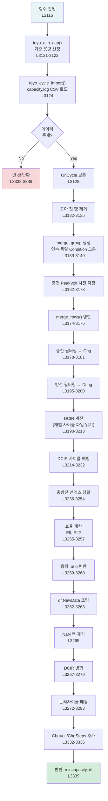

# toyo_cycle_data() 라인별 분석

> **학습 목표**: Toyo 충방전기의 CSV 원시 데이터가 `df.NewData` DataFrame으로 변환되는
> 전 과정을 **라인 단위**로 이해한다. 각 코드 블록에서 데이터가 어떻게 변형되는지,
> 그리고 그 변형이 **배터리 물리량**(용량, 효율, 저항 등)과 어떻게 대응하는지 체화한다.

**대상 함수**: `toyo_cycle_data()` — `DataTool_optRCD_proto_.py` L3116–3339  
**선행 학습**: [[260409_study_01_cycle_data_pipeline_overview|Study 01: 파이프라인 개요]]

---

## 1. 함수 시그니처 & 파라미터

```python
def toyo_cycle_data(raw_file_path, mincapacity, inirate, chkir):  # L3116
```

| 파라미터 | 타입 | 의미 | 예시 |
|---------|------|------|------|
| `raw_file_path` | `str` | Toyo 충방전기 채널 폴더 경로 | `"Z:\\Toyo1\\CH001"` |
| `mincapacity` | `float` | 사용자 지정 기준 용량 (mAh). `0`이면 자동 산정 | `3400` 또는 `0` |
| `inirate` | `float` | C-rate (용량 자동 산정용) | `0.2` (= 0.2C) |
| `chkir` | `bool` | DCIR 모드: `True`=일반 DCIR, `False`=연속 번호 DCIR | UI 라디오 버튼 |

**반환값**: `[mincapacity, df]`
- `mincapacity`: 최종 확정된 기준 용량 (mAh)
- `df`: 속성으로 `df.NewData` (핵심 DataFrame)와 `df.cycle_map` (논리사이클 매핑)을 가짐

---

## 2. 전체 흐름도



---

## 3. 라인별 상세 분석

### 3.1 초기화 & 기준 용량 산정 (L3119–3126)

```python
df = pd.DataFrame()                                              # L3119
# df: 빈 DataFrame. 이후 df.NewData, df.cycle_map 등의 
#      사용자 정의 속성을 붙여 복합 컨테이너로 사용한다.
#      ⚠ pandas의 정식 API가 아닌 동적 속성 방식 (레거시 패턴)

tempmincap = toyo_min_cap(raw_file_path, mincapacity, inirate)   # L3121
mincapacity = tempmincap                                         # L3122
# toyo_min_cap()은 기준 용량을 결정한다:
#   - mincapacity > 0  → 사용자가 직접 입력한 값을 그대로 사용
#   - mincapacity == 0 → 두 가지 방법으로 자동 산정:
#     (a) 경로에 "mAh" 문자열 포함 → name_capacity()로 정규식 추출
#         예: "3400mAh_RT23_Cyc" → 3400.0
#     (b) 그 외 → 첫 사이클 파일의 최대 전류 / C-rate
#         예: max_current=680mA, inirate=0.2 → 680/0.2 = 3400 mAh
#
# 🔋 물리적 의미: "기준 용량"은 이후 모든 용량을 ratio(%)로 변환할 때
#   분모가 되는 값이다. 정확한 기준 용량 = 정확한 열화 추적.

tempdata = toyo_cycle_import(raw_file_path)                      # L3124
# capacity.log를 읽어 DataFrame으로 반환한다.
# Toyo 충방전기는 모든 사이클 요약을 capacity.log 한 파일에 기록.
# 컬럼: TotlCycle, Condition, Cap[mAh], Ocv, Finish, Mode,
#        PeakVolt[V], Pow[mWh], PeakTemp[Deg], AveVolt[V]
# ⚠ BLK3600과 BLK5200 모델은 컬럼명이 다르므로 toyo_cycle_import()에서 정규화.

if hasattr(tempdata, "dataraw") and not tempdata.dataraw.empty:  # L3125
    Cycleraw = tempdata.dataraw                                  # L3126
```

> **포인트**: `toyo_cycle_import()`는 빈 DataFrame에 `.dataraw` 속성을 붙여 반환한다.
> 데이터가 없으면 `hasattr` 체크에서 빠져 빈 df를 반환한다.

---

### 3.2 OriCycle 보존 & 고아 행 제거 (L3128–3135)

```python
Cycleraw.loc[:, "OriCycle"] = Cycleraw.loc[:, "TotlCycle"]      # L3128
# OriCycle = 원본 사이클 번호를 별도 컬럼으로 복사.
# 이후 TotlCycle이 변경되더라도 원본 번호를 추적할 수 있다.
# 🔋 개별 사이클 파일(000001, 000002 ...)은 TotlCycle 기준으로 이름이
#    붙어 있으므로, DCIR 파일 읽기 시 OriCycle이 정확해야 한다.

if Cycleraw.loc[0, "Condition"] == 2 and len(Cycleraw.index) > 2: # L3132
    if Cycleraw.loc[1, "TotlCycle"] == 1:                         # L3133
        Cycleraw = Cycleraw.drop(0, axis=0)                       # L3134
        Cycleraw = Cycleraw.reset_index()                         # L3135
# "고아 방전" 제거: 시험 시작 시 불완전한 방전이 첫 행에 남는 경우가 있다.
# 예: 시험 시작 → 즉시 방전 0.1mAh (→ Condition==2) → 첫 충전 시작
# 이 첫 행은 정상 충방전 쌍에 포함되지 않으므로 제거한다.
#
# 조건: 첫 행이 방전(2)이고, 두 번째 행의 TotlCycle이 1이면
#        (= 시험 첫 사이클의 첫 행이 방전으로 시작)
#
# ⚠ 과거 버그: Condition==2인 모든 행의 TotlCycle을 -= 1 했었음
#   → DCIR 파일 번호 불일치 유발. 현재는 고아 행만 드롭하는 방식으로 수정됨.
```

#### DataFrame 변환 시각화 (고아 행 제거)

```
[제거 전]
idx | TotlCycle | Condition | Cap[mAh]
  0 |    0      |     2     |   0.03    ← 고아 방전 (시험 시작 잔류)
  1 |    1      |     1     |  3380.5   ← 첫 충전
  2 |    1      |     2     |  3350.2   ← 첫 방전
  ...

[제거 후]
idx | TotlCycle | Condition | Cap[mAh]
  0 |    1      |     1     |  3380.5   ← 첫 충전
  1 |    1      |     2     |  3350.2   ← 첫 방전
  ...
```

---

### 3.3 merge_group: 연속 동일 Condition 병합 준비 (L3139–3140)

```python
cond_series = Cycleraw["Condition"]                              # L3139
merge_group = (
    (cond_series != cond_series.shift())  # 현재 행의 Condition이 이전과 다르면 True
    | (~cond_series.isin([1, 2]))         # Condition이 1(충전) 또는 2(방전)가 아니면 True
).cumsum()                                                       # L3140
```

이 코드는 **연속된 동일 Condition 행을 하나의 그룹으로 묶는** 핵심 로직이다.

#### 동작 원리 (단계별)

```
Step 1: cond_series != cond_series.shift()
  → Condition이 바뀌는 경계에서 True

Step 2: ~cond_series.isin([1, 2])
  → Condition이 3(Rest) 등인 행에서 True

Step 3: (Step1) | (Step2)
  → "새 그룹이 시작되어야 하는 경계"에서 True

Step 4: .cumsum()
  → True가 나올 때마다 +1 → 고유 그룹 번호 생성
```

#### 예시

```
idx | Condition | shift≠ | ¬in{1,2} | OR  | cumsum = merge_group
  0 |     1     |  True  |  False   | True |  1  ← 충전 그룹 A
  1 |     1     |  False |  False   | False|  1  ← 같은 그룹 A (다단 충전)
  2 |     1     |  False |  False   | False|  1  ← 같은 그룹 A
  3 |     3     |  True  |  True    | True |  2  ← Rest (단독)
  4 |     2     |  True  |  False   | True |  3  ← 방전 그룹 B
  5 |     2     |  False |  False   | False|  3  ← 같은 그룹 B
  6 |     1     |  True  |  False   | True |  4  ← 다음 충전
```

> 🔋 **왜 병합이 필요한가?**
> Toyo 충방전기는 **다단 충전**(CC → CV, 또는 다단 CC)을 각 스텝마다 별도 행으로 기록한다.
> 예: `2C CC → 1.6C CC → 1.3C CC → 1C CC → CV hold` = 5행.
> 하지만 BDT는 이것을 **하나의 "충전"**으로 취급해야 한다.
> 물리적으로 이 5개 스텝은 모두 같은 사이클의 충전 과정이기 때문이다.

---

### 3.4 merge_rows(): 그룹 병합 로직 (L3142–3159)

```python
def merge_rows(group):                                           # L3142
    if len(group) == 1:                                          # L3144
        return group.iloc[0]  # 단일 행이면 그대로 반환
    cond = group["Condition"].iloc[0]                            # L3146
    result = group.iloc[-1].copy()  # 마지막 행 기준으로 시작       # L3147
    # ⚠ 마지막 행 기준인 이유: 최종 전압(PeakVolt), 온도(PeakTemp) 등은
    #    충방전이 끝난 시점의 값이 의미 있기 때문
    
    if cond == 1:  # 충전                                        # L3148
        result["Cap[mAh]"] = group["Cap[mAh]"].sum()             # L3150
        # 🔋 다단 충전의 용량은 합산해야 한다.
        #    CC1: 2800mAh + CC2: 300mAh + CV: 200mAh = 총 3300mAh
        result["Ocv"] = group["Ocv"].iloc[0]                     # L3151
        # 🔋 Ocv(Rest End Voltage)는 충전 시작 전의 안정화 전압이므로
        #    첫 번째 스텝의 Ocv가 물리적으로 의미 있다.
    
    elif cond == 2:  # 방전                                      # L3152
        result["Cap[mAh]"] = group["Cap[mAh]"].sum()             # L3154
        result["Pow[mWh]"] = group["Pow[mWh]"].sum()             # L3155
        result["Ocv"] = group["Ocv"].iloc[0]                     # L3156
        if result["Cap[mAh]"] != 0:                              # L3157
            result["AveVolt[V]"] = result["Pow[mWh]"] / result["Cap[mAh]"]  # L3158
            # 🔋 평균 방전 전압 = 총 에너지 / 총 용량
            #    V_avg = E(mWh) / Q(mAh) = mWh/mAh = V
            #    이 값이 사이클마다 감소하면 → 내부 저항 증가 의미
    return result                                                # L3159
```

#### 병합 전/후 시각화

```
[병합 전 — 다단 충전]
TotlCycle=5, Condition=1, Cap=2800, PeakVolt=4.10, Ocv=3.42   ← CC 2C
TotlCycle=5, Condition=1, Cap=300,  PeakVolt=4.15, Ocv=3.42   ← CC 1.6C
TotlCycle=5, Condition=1, Cap=200,  PeakVolt=4.20, Ocv=3.42   ← CV hold

[병합 후]
TotlCycle=5, Condition=1, Cap=3300, PeakVolt=4.20, Ocv=3.42
                                ↑ 합산        ↑ 마지막행     ↑ 첫행
```

---

### 3.5 충전 PeakVolt 사전 저장 (L3162–3173)

```python
_chg_pre = Cycleraw[Cycleraw['Condition'] == 1]                 # L3162
_mg_chg = merge_group[_chg_pre.index]                           # L3163
# merge_group에서 충전 행만 추출 → 어떤 행이 같은 충전 그룹인지 식별

if 'PeakVolt[V]' in _chg_pre.columns and len(_chg_pre) > 0:    # L3164
    _peak_by_mg = _chg_pre.groupby(_mg_chg)['PeakVolt[V]'].max() # L3165
    # 🔋 다단 충전 중 가장 높은 전압 = 충전 상한 전압
    #    CC에서 4.10V → CV에서 4.20V → max = 4.20V
    _peak_by_mg = (_peak_by_mg * 100).round() / 100             # L3166
    # 소수점 2자리 반올림 (4.199999 → 4.20)
    
    _steps_by_mg = _chg_pre.groupby(_mg_chg).size()             # L3167
    # 각 충전의 스텝 수 (다단 충전 = 3~5, 단일 CC-CV = 2)
    
    _last_tc = _chg_pre.groupby(_mg_chg)['TotlCycle'].last()    # L3168
    # 각 충전 그룹의 마지막 TotlCycle → 병합 후 인덱스로 사용
    
    _chg_volt_map = pd.Series(_peak_by_mg.values, index=_last_tc.values) # L3169
    _chg_steps_map = pd.Series(_steps_by_mg.values, index=_last_tc.values) # L3170
```

> **왜 병합 전에 저장하는가?**
> `merge_rows()`는 마지막 행의 PeakVolt만 남기는데, 다단 충전의 첫 스텝이
> 가장 높은 전압을 가질 수도 있다. 정확한 max를 위해 병합 전에 미리 계산.

---

### 3.6 병합 실행 & 충방전 필터링 (L3175–3200)

```python
# 실제 병합 실행
Cycleraw = Cycleraw.groupby(merge_group, group_keys=False) \
                    .apply(merge_rows, include_groups=False)      # L3175
Cycleraw = Cycleraw.reset_index(drop=True)                      # L3176
```

병합 후 각 행은 **하나의 스텝**(충전 1회 또는 방전 1회 또는 Rest 1회)에 대응한다.

```python
# ── 충전 데이터 필터링 ──
chgdata = Cycleraw[
    (Cycleraw["Condition"] == 1)                                 # 충전만
    & (Cycleraw["Finish"] != "                 Vol")             # "Vol" 종료 제외
    & (Cycleraw["Finish"] != "Volt")                             # (BLK 모델별 문자열 차이)
    & (Cycleraw["Cap[mAh]"] > (mincapacity / 60))               # 용량 임계값
]                                                                # L3178-3179
chgdata.index = chgdata["TotlCycle"]                             # L3180
Chg = chgdata["Cap[mAh]"]                                       # L3181
```

> 🔋 **`mincapacity / 60` 임계값의 의미**:
> 기준 용량이 3400mAh이면 임계값 = 3400/60 ≈ 56.7mAh.
> 이보다 작은 용량의 "충전"은 **진짜 충전이 아니라** DCIR 펄스, 짧은 OCV 체크 등이다.
> 물리적으로 56.7mAh ≈ 셀 용량의 1.7% → 이 이하는 의미 있는 충전이 아님.
>
> **`Finish != "Vol"` 제외 이유**:
> Finish 컬럼은 스텝 종료 조건을 나타낸다. "Vol"(Voltage) 종료 = CV 홀드 스텝.
> 다단 충전에서 개별 CV 스텝이 별도 행으로 남아있을 수 있으므로 제외.
> (병합에서 처리되었어야 하지만, 안전장치로 이중 필터링)

```python
# ── 방전 데이터 필터링 ──
Dchgdata = Cycleraw[
    (Cycleraw["Condition"] == 2)                                 # 방전만
    & (Cycleraw["Cap[mAh]"] > (mincapacity / 60))               # 동일 임계값
]                                                                # L3195
Dchg = Dchgdata["Cap[mAh]"]                                     # L3196
Temp = Dchgdata["PeakTemp[Deg]"]                                # L3197
DchgEng = Dchgdata["Pow[mWh]"]                                  # L3198
AvgV = Dchgdata["AveVolt[V]"]                                   # L3199
OriCycle = Dchgdata.loc[:, "OriCycle"]                           # L3200
```

> 🔋 **추출되는 물리량**:
> - `Dchg`: 방전 용량 (mAh) — 셀이 실제 내보낸 전하량
> - `Temp`: 방전 중 최고 온도 (°C) — 발열 모니터링
> - `DchgEng`: 방전 에너지 (mWh) — 실제 사용 가능 에너지
> - `AvgV`: 평균 방전 전압 (V) — 내부 저항 변화 지표
> - `OriCycle`: 원본 사이클 번호 — 개별 파일 접근용

---

### 3.7 DCIR 계산 — 개별 사이클 파일 읽기 (L3190–3213)

```python
# DCIR 행 필터링: 짧은 방전 + Time 종료 = DCIR 펄스
dcir = Cycleraw[
    ((Cycleraw["Finish"] == "                 Tim")              # "Tim" 종료
     | (Cycleraw["Finish"] == "Tim")
     | (Cycleraw["Finish"] == "Time"))                           # BLK 모델별 차이
    & (Cycleraw["Condition"] == 2)                               # 방전
    & (Cycleraw["Cap[mAh]"] < (mincapacity / 60))               # 용량 < 임계값
]                                                                # L3190-3192
cycnum = dcir["TotlCycle"]                                       # L3193
```

> 🔋 **DCIR 펄스 식별 로직**:
> DCIR 측정은 "짧은 시간 동안 방전 펄스를 주고 전압 변화를 측정"하는 것이다.
> 따라서:
> - `Condition == 2` (방전)
> - `Finish == "Tim"` (시간으로 종료 = 일정 시간 펄스)
> - `Cap < mincapacity/60` (용량이 작음 = 짧은 펄스)
> 이 세 조건을 모두 만족하면 "DCIR 측정 스텝"으로 판별된다.

```python
for cycle in cycnum:                                             # L3202
    if os.path.isfile(raw_file_path + "\\%06d" % cycle):         # L3203
        # 개별 사이클 프로필 파일 읽기 (000001, 000002 ...)
        dcirpro = pd.read_csv(
            (raw_file_path + "\\%06d" % cycle),
            sep=",", skiprows=3, engine="c",
            encoding="cp949", on_bad_lines='skip'
        )                                                        # L3204-3205
        # skiprows=3: Toyo 프로필 파일의 처음 3줄은 헤더/메타데이터
        
        # 컬럼명 정규화 (BLK3600 vs BLK5200)
        if "PassTime[Sec]" in dcirpro.columns:                   # L3206
            dcirpro = dcirpro[["PassTime[Sec]", "Voltage[V]",
                               "Current[mA]", "Condition", "Temp1[Deg]"]]
        else:                                                    # L3209
            dcirpro = dcirpro[["Passed Time[Sec]", "Voltage[V]",
                               "Current[mA]", "Condition", "Temp1[deg]"]]
            dcirpro.columns = ["PassTime[Sec]", "Voltage[V]",
                               "Current[mA]", "Condition", "Temp1[Deg]"]
        
        dcircal = dcirpro[(dcirpro["Condition"] == 2)]           # L3211
        # 방전 구간만 추출 (DCIR 펄스의 방전 부분)
        
        dcir.loc[int(cycle), "dcir"] = (
            (dcircal["Voltage[V]"].max() - dcircal["Voltage[V]"].min())
            / round(dcircal["Current[mA]"].max()) * 1000000
        )                                                        # L3212-3213
```

> 🔋 **DCIR 계산 공식**:
> ```
> DCIR = ΔV / I = (V_max - V_min) / I_pulse × 1,000,000
> ```
> - `V_max - V_min`: 펄스 방전 중 전압 변화량 (V)
> - `I_pulse`: 방전 전류 (mA, max로 근사)
> - `× 1,000,000`: mA → μA 변환... 아닌가?
>
> **실제 단위 분석**:
> ```
> (V) / (mA) = V/mA = kΩ
> (V) / (mA) × 1,000,000 = V/mA × 10⁶ = MΩ? → 이상함
> ```
> ⚠ 실제로는 `Current[mA]`가 음수일 수 있어 `round(max)`가 절대값 역할.
> 결과 단위는 **mΩ**로 보아야 함: `(V / A) × 1000 = mΩ`
> → `V / (mA/1000) × 1000 = V × 10⁶ / mA` ... 코드 확인 필요.
> 실제 DCIR 결과값이 20~100 범위에 있으면 mΩ 스케일이 맞음.

---

### 3.8 DCIR 사이클 매핑 (L3214–3232)

```python
n = 1                                                            # L3214
cyccal = []                                                      # L3215
if len(dcir) != 0:                                               # L3216
    if (len(Dchg) / (len(dcir) / 2)) >= 10:                     # L3217
        dcirstep = (int(len(Dchg) / (len(dcir) / 2) / 10) + 1) * 10
    else:                                                        # L3219
        dcirstep = int(len(Dchg) / (len(dcir) / 2)) + 1         # L3220
    # dcirstep = DCIR 측정 사이 간격 (예: 100사이클마다 DCIR → dcirstep ≈ 100)
    # len(dcir)/2: DCIR은 보통 펄스 쌍(방전+충전)으로 2행씩 기록
    # len(Dchg)/(len(dcir)/2): 전체 사이클 수 / DCIR 세트 수 = 간격
    
    for i in range(len(dcir)):                                   # L3221
        if chkir:                                                # L3222
            # 일반 DCIR 모드: 매 DCIR 행에 연속 번호 부여
            cyccal.append(n)                                     # L3223
            n = n + 1                                            # L3224
        else:                                                    # L3225
            # 쌍 DCIR 모드: 홀수 행 → 번호 +1, 짝수 행 → 큰 점프
            cyccal.append(n)                                     # L3226
            if i % 2 == 0:                                       # L3227
                n = n + 1                                        # L3228
            else:                                                # L3229
                n = n + dcirstep - 1                             # L3230
                # 짝수 인덱스(두 번째 펄스 후) → 다음 DCIR 세트까지 점프
                
dcir["Cyc"] = cyccal                                             # L3231
dcir = dcir.set_index(dcir["Cyc"])                               # L3232
# Cyc 인덱스를 부여하여 df.NewData의 Cycle 축과 매핑 가능하게 함
```

> 🔋 **DCIR 사이클 매핑의 의미**:
> 수명시험에서 DCIR은 매 사이클이 아닌 **주기적으로** 측정된다 (예: 100사이클마다).
> 그래프에서 DCIR 점을 올바른 X축(사이클) 위치에 찍으려면,
> 각 DCIR 측정이 몇 번째 사이클에 해당하는지 매핑해야 한다.

---

### 3.9 충방전 인덱스 정렬 (L3233–3254) ⭐ 핵심 로직

```python
# ── 충방전 효율 계산 (병합 후 TotlCycle 인덱스 보정) ──
# Toyo 병합 시 Chg 인덱스(8,13,18…)와 Dchg 인덱스(9,14,19…)가
# 1칸씩 어긋나므로, 순서(위치) 기반으로 재정렬하여 매칭

if len(Dchg) > 0 and len(Chg) > 0:                              # L3236
    if Dchg.index[0] < Chg.index[0]:                             # L3238
        # 방전이 충전보다 먼저 나온 경우 → 초기 부분 방전 제거
        Dchg = Dchg.iloc[1:]                                     # L3239
        Temp = Temp.iloc[1:]                                     # L3240
        DchgEng = DchgEng.iloc[1:]                               # L3241
        AvgV = AvgV.iloc[1:]                                     # L3242
        OriCycle = OriCycle.iloc[1:]                              # L3243
    
    # Chg/Ocv/ChgVolt/ChgSteps를 Dchg 인덱스에 위치 기반 재정렬
    _nmin = min(len(Chg), len(Dchg))                             # L3245
    Chg = pd.Series(Chg.values[:_nmin], index=Dchg.index[:_nmin])   # L3246
    Ocv = pd.Series(Ocv.values[:_nmin], index=Dchg.index[:_nmin])   # L3247
    _ChgVolt = pd.Series(_ChgVolt.values[:_nmin], index=Dchg.index[:_nmin]) # L3248
    _ChgSteps = pd.Series(_ChgSteps.values[:_nmin], index=Dchg.index[:_nmin]) # L3249
    Dchg = Dchg.iloc[:_nmin]                                    # L3250
    Temp = Temp.iloc[:_nmin]                                     # L3251
    DchgEng = DchgEng.iloc[:_nmin]                               # L3252
    AvgV = AvgV.iloc[:_nmin]                                     # L3253
    OriCycle = OriCycle.iloc[:_nmin]                              # L3254
```

> 🔋 **왜 인덱스가 어긋나는가?**
> 
> 병합(merge_rows) 후의 Cycleraw 구조:
> ```
> TotlCycle | Condition | 설명
>     1     |     3     | Rest
>     1     |     1     | 충전 (다단 병합) → Chg 인덱스 = 1
>     1     |     3     | Rest
>     1     |     2     | 방전              → Dchg 인덱스 = 1
>     2     |     1     | 충전              → Chg 인덱스 = 2
>     2     |     2     | 방전              → Dchg 인덱스 = 2
> ```
> 
> `chgdata.index = chgdata["TotlCycle"]`로 설정했으므로
> Chg.index = [1, 2, 3, ...], Dchg.index = [1, 2, 3, ...]
> → **대부분 동일하지만**, DCIR 스텝이 끼어있거나 Rest가 비대칭이면
> 인덱스가 어긋날 수 있다.
> 
> **해결 방법**: `.values[:_nmin]`으로 값만 추출 → Dchg의 인덱스로 강제 재할당.
> 즉, **인덱스(사이클 번호) 매칭이 아닌 순서(위치) 매칭**으로 처리.
> 첫 번째 충전 → 첫 번째 방전, 두 번째 충전 → 두 번째 방전, ...

---

### 3.10 효율 계산 & 용량 ratio 변환 (L3255–3260)

```python
Chg2 = Chg.shift(periods=-1)                                    # L3255
# Chg2 = 다음 사이클의 충전 용량 (n+1번째 충전)
# shift(-1): 한 칸 위로 이동 → 현재 행에 다음 값이 들어옴

Eff = Dchg / Chg                                                 # L3256
# 🔋 쿨롱 효율 (Coulombic Efficiency)
# Eff = 방전용량 / 충전용량 (같은 사이클)
# 이상적: 100%. 실제: 99.5~99.99%
# Eff < 100% → SEI 성장, 부반응으로 리튬 소모
# Eff > 100% → 측정 오류 또는 불완전 CV 스텝

Eff2 = Chg2 / Dchg                                              # L3257
# 🔋 교차 효율 (Cross-cycle Efficiency, BDT 고유 지표)
# Eff2 = 다음충전(n+1) / 현재방전(n)
# 물리적 의미: 방전으로 빠진 리튬이 다음 충전에서 얼마나 돌아오는지
# Eff2 ≈ 1.0 → 가역적 (리튬 손실 없음)
# Eff2 < 1.0 → 비가역 리튬 소모 발생

Dchg = Dchg / mincapacity                                       # L3259
Chg = Chg / mincapacity                                         # L3260
# 🔋 용량 ratio 변환: 절대값(mAh) → 비율(무차원)
# 예: 3400mAh / 3400mAh = 1.0 (100%)
#     3200mAh / 3400mAh = 0.941 (94.1%)
# 이후 그래프에서 Y축을 0~1.0 (또는 ×100 → %)으로 표시
```

#### 효율 계산 시각화

```
사이클:    n-1       n        n+1
          |---------|---------|---------|
충전(Chg):    3380      3370      3360   (mAh)
방전(Dchg):   3350      3340      3330   (mAh)

Eff[n]  = Dchg[n] / Chg[n]  = 3340 / 3370 = 0.9911 (99.11%)
Eff2[n] = Chg[n+1] / Dchg[n] = 3360 / 3340 = 1.006  (100.6%)

Eff2 > 1은 전 사이클 방전 후 Rest 중 회복된 용량이
다음 충전에 반영되기 때문에 발생할 수 있다.
```

---

### 3.11 df.NewData 조립 (L3262–3271)

```python
df.NewData = pd.DataFrame({
    "Dchg": Dchg,         # 방전 용량 ratio (0~1)
    "RndV": Ocv,          # Rest 후 전압 (V) ≈ OCV
    "Eff": Eff,           # 쿨롱 효율 (Dchg/Chg)
    "Chg": Chg,           # 충전 용량 ratio (0~1)
    "DchgEng": DchgEng,   # 방전 에너지 (mWh)
    "Eff2": Eff2,         # 교차 효율 (Chg(n+1)/Dchg(n))
    "Temp": Temp,         # 방전 최고 온도 (°C)
    "AvgV": AvgV,         # 평균 방전 전압 (V)
    "OriCyc": OriCycle    # 원본 사이클 번호
})                                                               # L3262-3263

df.NewData = df.NewData.dropna(subset=['Dchg', 'Chg'], how='any') # L3265
# Dchg 또는 Chg 중 하나라도 NaN → 불완전 사이클 → 제거
# 🔋 불완전 사이클: 충전은 있지만 방전이 없거나, 그 반대인 경우
#    예: 시험 중단 시 마지막 사이클이 충전만 완료된 상태

df.NewData = df.NewData.reset_index()                            # L3266
# reset_index()로 TotlCycle 인덱스를 일반 컬럼으로 변환
# → 이 시점에서 "TotlCycle" 컬럼이 추가됨

if hasattr(dcir, "dcir"):                                        # L3267
    df.NewData = pd.concat([df.NewData, dcir["dcir"]], 
                           axis=1, join="outer")                 # L3268
    # DCIR 값을 df.NewData에 outer join으로 병합
    # outer join: DCIR이 없는 사이클은 NaN으로 남음
else:                                                            # L3269
    df.NewData.loc[0, "dcir"] = 0                                # L3270
    # DCIR 데이터가 전혀 없으면 0으로 초기화

df.NewData = df.NewData.drop("TotlCycle", axis=1)               # L3271
# TotlCycle 컬럼 제거 (이후 Cycle 컬럼으로 대체)
```

#### df.NewData 최종 구조

```
| Cycle | Dchg   | Chg    | Eff    | Eff2   | RndV  | Temp | AvgV  | DchgEng | OriCyc | dcir |
|-------|--------|--------|--------|--------|-------|------|-------|---------|--------|------|
| 1     | 1.0000 | 1.0059 | 0.9941 | 1.0012 | 4.178 | 24.3 | 3.725 | 12415   | 8      | NaN  |
| 2     | 0.9985 | 1.0032 | 0.9953 | 1.0008 | 4.176 | 24.5 | 3.722 | 12390   | 13     | NaN  |
| ...   | ...    | ...    | ...    | ...    | ...   | ...  | ...   | ...     | ...    | ...  |
| 100   | 0.9850 | 0.9881 | 0.9969 | NaN    | 4.170 | 24.8 | 3.715 | 12200   | 503    | 45.2 |
```

---

### 3.12 논리사이클 매핑 & 최종 마무리 (L3272–3339)

```python
# ── .ptn 구조 분석 → 논리사이클 힌트 ──
_ptn_struct = None
try:
    _ptn_struct = extract_toyo_ptn_structure(raw_file_path, mincapacity)
except Exception:
    _ptn_struct = None                                           # L3273-3277
# .ptn 파일: Toyo 시험 패턴 정의 파일.
# 이 파일을 분석하면 "100사이클마다 RPT 수행" 같은 패턴 구조를 알 수 있다.
# 🔋 RPT(Reference Performance Test): 정기적으로 저율 충방전하여 실제 용량 확인

_cycle_map = None
try:
    _cycle_map, _ = toyo_build_cycle_map(
        raw_file_path, mincapacity, inirate, ptn_struct=_ptn_struct,
    )
except Exception:
    _cycle_map = None                                            # L3279-3285
# cycle_map: {논리사이클 → OriCycle 범위} 매핑
# 예: {1: (1,5), 2: (6,10), ...} = 논리사이클 1은 OriCycle 1~5 범위
# 스윕 시험 등에서 여러 물리 사이클이 하나의 논리 단위를 이루는 경우 사용

if _cycle_map and len(df.NewData) > 0:                           # L3286
    df.NewData.insert(0, "Cycle", range(1, len(df.NewData) + 1)) # L3289
else:                                                            # L3290
    df.NewData.insert(0, "Cycle", range(1, len(df.NewData) + 1)) # L3292
# ⚠ 현재 Toyo는 cycle_map 유무와 관계없이 항상 순번(1,2,3,...) 부여.
# cycle_map은 df.cycle_map에 보존되어 프로필 파이프라인에서 활용.

df.cycle_map = _cycle_map if _cycle_map else {}                  # L3293

# ── 충전 상한 전압/스텝 수 추가 (L3332-3336) ──
if len(df.NewData) > 0 and len(_ChgVolt.dropna()) > 0:          # L3333
    _n = min(len(_ChgVolt), len(df.NewData))                     # L3334
    df.NewData.loc[df.NewData.index[:_n], 'ChgVolt'] = _ChgVolt.values[:_n]   # L3335
    df.NewData.loc[df.NewData.index[:_n], 'ChgSteps'] = _ChgSteps.values[:_n] # L3336
# ChgVolt: 각 사이클 충전 상한 전압 (V)
# ChgSteps: 충전 스텝 수 (다단 CC = 4~5, 단일 CC-CV = 2)
# 🔋 ChgVolt 변화 추적 → 패턴 변경이나 장비 이상 감지 가능

return [mincapacity, df]                                         # L3339
```

---

## 4. 핵심 헬퍼 함수 요약

### 4.1 toyo_read_csv() — L3044–3060

```python
def toyo_read_csv(*args):
    # args가 1개 → capacity.log 읽기 (캐시 적용)
    # args가 2개 → 개별 사이클 파일 읽기 (000001 등)
    # 🔑 캐시: _get_channel_cache()로 동일 경로 재읽기 방지
    # encoding="cp949": Toyo는 한국어 Windows 인코딩 사용
```

### 4.2 toyo_cycle_import() — L3084–3096

```python
def toyo_cycle_import(raw_file_path):
    # capacity.log → DataFrame 변환
    # BLK3600: "Cap[mAh]", "Ocv" 등 짧은 컬럼명
    # BLK5200: "Capacity[mAh]", "OCV[V]" 등 긴 컬럼명 → 짧은 이름으로 정규화
    # 🔑 10개 컬럼만 추출하여 메모리 절약
```

### 4.3 toyo_min_cap() — L3099–3113

```python
def toyo_min_cap(raw_file_path, mincapacity, inirate):
    # mincapacity > 0  → 그대로 반환
    # mincapacity == 0 → 자동 산정:
    #   (a) 경로에 "mAh" → 정규식 추출
    #   (b) 첫 사이클 최대 전류 / C-rate
    # 🔑 캐시 적용으로 반복 호출 시 재계산 방지
```

### 4.4 name_capacity() — L364–378

```python
def name_capacity(data_file_path):
    # 경로 문자열에서 "XXXXmAh" 패턴을 정규식으로 추출
    # 예: "3400mAh" → 3400.0, "3-4mAh" → 3.4
    # 특수문자(._@[]()) → 공백으로 치환 후 매칭
```

---

## 5. 주의 사항 & 레거시 패턴

### 5.1 df에 동적 속성 붙이기
```python
df = pd.DataFrame()
df.NewData = pd.DataFrame(...)  # pandas 공식 API 아님!
df.cycle_map = {}               # 동적 속성
```
이는 pandas의 정식 사용법이 아니다. `df.NewData`는 DataFrame의 컬럼이 아닌 **Python 객체 속성**이다.
정식 패턴은 딕셔너리나 namedtuple을 사용하는 것이지만, BDT 전체에 이 패턴이 깊이 박혀 있어 리팩토링 대상.

### 5.2 os.path vs pathlib
```python
os.path.isfile(raw_file_path + "\\%06d" % cycle)  # 레거시 패턴
```
`pathlib.Path` 사용이 권장되지만 기존 코드 호환성을 위해 유지. 새 함수에서는 `pathlib` 사용.

### 5.3 DCIR 단위 불확실성
DCIR 계산의 `× 1000000` 스케일링이 명확하지 않다. 실제 출력값과 비교하여 단위를 확인해야 함.
(결과가 20~100 범위면 mΩ, 20000~100000이면 μΩ 가능성)

---

## 6. 학습 체크리스트

- [ ] `merge_group`의 `cumsum()` 패턴을 직접 작은 데이터로 실행해보기
- [ ] `merge_rows()`에서 왜 마지막 행 기준인지 물리적으로 설명할 수 있는가?
- [ ] Eff와 Eff2의 차이를 배터리 물리 관점에서 설명할 수 있는가?
- [ ] 충방전 인덱스가 어긋나는 상황을 구체적 예시로 그려볼 수 있는가?
- [ ] DCIR 펄스 식별 3가지 조건의 물리적 근거를 설명할 수 있는가?
- [ ] `mincapacity/60` 임계값의 의미를 다른 용량의 셀에 적용해볼 수 있는가?

---

## 다음 학습

- [[260409_study_03_pne_cycle_data|Study 03: PNE 사이클 데이터 처리]] — PNE 바이너리 데이터의 3가지 DCIR 모드, pivot_table 집계
- [[260409_study_04_graph_output_cycle|Study 04: graph_output_cycle() 플로팅]]
