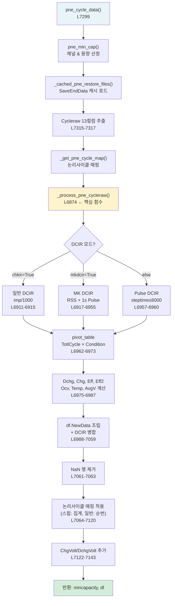

# PNE 사이클 데이터 처리 라인별 분석

> **학습 목표**: PNE 충방전기의 바이너리 데이터가 `df.NewData`로 변환되는 전 과정을 이해한다.
> 특히 **3가지 DCIR 계산 모드**, **pivot_table 집계**, **논리사이클 매핑**의 동작 원리를
> 라인 단위로 체화한다.

**대상 함수**:
- `pne_cycle_data()` — L7299–7331 (진입점)
- `_process_pne_cycleraw()` — L6874–7144 (핵심 변환 로직)

**선행 학습**: [[260409_study_02_toyo_cycle_data|Study 02: Toyo 사이클 데이터]]

---

## 1. PNE vs Toyo 핵심 차이

| 항목 | Toyo | PNE |
|------|------|-----|
| 원시 데이터 형식 | CSV (`capacity.log`) | 바이너리 (`.cyc` → `SaveEndData.csv`) |
| 단위 체계 | V, mA, mAh (표시 단위 그대로) | **μV, μA, μAh** (÷1,000,000 필요) |
| 사이클 요약 방식 | 각 스텝이 1행 (다단 충전 = 여러 행) | 각 스텝이 1행 (46개 원시 컬럼) |
| 병합 방식 | `merge_group` + `groupby.apply` | **`pivot_table`** (Condition 기준) |
| DCIR 계산 | 개별 사이클 파일 읽기 | Cycleraw 내 `imp` 컬럼 활용 |
| DCIR 모드 | 1가지 (일반) | **3가지** (일반, MK, Pulse) |

---

## 2. 전체 흐름도



---

## 3. pne_cycle_data() — 진입점 (L7299–7331)

```python
def pne_cycle_data(raw_file_path, mincapacity, ini_crate, chkir, chkir2, mkdcir):
    # L7300-7304: PNE 바이너리 원시 데이터 컬럼 설명 (docstring)
    # 46개 컬럼 중 번호로 접근: 0=Index, 2=StepType, 8=Voltage(μV), 9=Current(μA), ...
    
    df = pd.DataFrame()                                          # L7307
    
    if (raw_file_path[-4:-1]) != "ter":                          # L7308
        # "ter" = "master" 경로의 끝 3글자 — master 폴더 자체는 스킵
        # 실제 데이터는 하위 채널 폴더에 있음
        
        mincapacity = pne_min_cap(raw_file_path, mincapacity, ini_crate) # L7310
        # Toyo의 toyo_min_cap()과 동일한 역할
        # PNE는 SaveEndData에서 첫 사이클 전류로 용량 산정
```

> 🔋 **PNE 파라미터 차이**: Toyo는 `chkir` 하나지만, PNE는 `chkir`, `chkir2`, `mkdcir` 3개.
> 이는 PNE 충방전기가 지원하는 DCIR 측정 모드가 다양하기 때문이다.

```python
        # SaveEndData 캐시 로드
        Cycleraw = None
        save_end_cached, _, _ = _cached_pne_restore_files(raw_file_path) # L7313
        if save_end_cached is not None and mincapacity is not None:      # L7314
            Cycleraw = save_end_cached[[27, 2, 10, 11, 8, 20, 45, 15, 17, 9, 24, 29, 6]].copy()
            # 46개 컬럼 중 필요한 13개만 추출 (번호로 접근)
            Cycleraw.columns = ["TotlCycle", "Condition", "chgCap", "DchgCap",
                                "Ocv", "imp", "volmax", "DchgEngD",
                                "steptime", "Curr", "Temp", "AvgV", "EndState"]
            # L7315-7317
```

#### PNE 원시 컬럼 → 추출 컬럼 매핑

| 원시 번호 | 추출 컬럼명 | 원시 단위 | 물리적 의미 |
|-----------|------------|----------|------------|
| 27 | TotlCycle | 정수 | 총 사이클 번호 |
| 2 | Condition | 코드 | 1=충전, 2=방전, 3=휴지, 8=loop |
| 10 | chgCap | μAh | 충전 용량 |
| 11 | DchgCap | μAh | 방전 용량 |
| 8 | Ocv | μV | 전압 (스텝 종료 시) |
| 20 | imp | μΩ? | 임피던스 (DCIR 원시값) |
| 45 | volmax | μV | 최대 전압 |
| 15 | DchgEngD | μWh | 방전 에너지 |
| 17 | steptime | 1/100초 | 스텝 시간 |
| 9 | Curr | μA | 전류 |
| 24 | Temp | m°C | 온도 (÷1000 = °C) |
| 29 | AvgV | mV | 평균 전압 |
| 6 | EndState | 코드 | 종료 상태 (64, 65, 66, 78 등) |

> ⚠ **PNE 단위 주의**: 거의 모든 값이 μ 단위이므로 ÷1,000,000 또는 ÷1,000이 필수.
> 이를 빠뜨리면 전압이 4,200,000V, 용량이 3,400,000mAh 같은 비현실적 값이 된다.

---

## 4. _process_pne_cycleraw() — 핵심 변환 (L6874–7144)

### 4.1 코인셀 단위 변환 (L6907–6910)

```python
if is_micro_unit(raw_file_path):                                 # L6907
    Cycleraw.DchgCap = Cycleraw.DchgCap / 1000                  # L6908
    Cycleraw.chgCap = Cycleraw.chgCap / 1000                    # L6909
    Cycleraw.Curr = Cycleraw.Curr / 1000                        # L6910
# 🔋 코인셀(2032 등)은 용량이 극히 작아 PNE가 nAh 단위로 기록.
#    일반 셀(μAh)과 코인셀(nAh)의 단위 차이를 보정.
#    is_micro_unit(): 경로에서 코인셀 여부 판별
```

---

### 4.2 DCIR 모드 ① — 일반 DCIR (chkir=True, L6911–6915)

```python
if chkir:
    dcirtemp = Cycleraw[
        (Cycleraw["Condition"] == 2)          # 방전 스텝
        & (Cycleraw["volmax"] > 4100000)      # 최대 전압 > 4.1V (μV 단위)
    ]                                                            # L6912
    dcirtemp.index = dcirtemp["TotlCycle"]                       # L6913
    dcir = dcirtemp.imp / 1000                                   # L6914
    # imp(μΩ?) ÷ 1000 = mΩ
    dcir = dcir[~dcir.index.duplicated()]                        # L6915
    # 동일 TotlCycle 중복 제거 (첫 번째 값만 유지)
```

> 🔋 **일반 DCIR**: PNE가 자체 측정한 `imp` 값을 그대로 사용.
> `volmax > 4.1V` 조건은 "충전 후 전압이 충분히 높은 상태에서 측정된 DCIR"을 선별.
> 이는 SOC가 높은 상태(≈100%)에서의 DCIR을 의미한다.

---

### 4.3 DCIR 모드 ② — MK DCIR (mkdcir=True, L6917–6955) ⭐

MK DCIR은 **가장 복잡한 모드**로, SOC별 RSS(정상상태) + 1초 Pulse DCIR을 동시에 계산한다.

```python
elif mkdcir:
    # ── Step 1: RSS CCV 스텝 선별 (EndState==78) ──
    dcirtemp1 = Cycleraw.loc[
        (Cycleraw['EndState'] == 78)                             # SOC 도달로 종료
        & (Cycleraw['Curr'].abs() >= 0.15 * mincapacity * 1000) # ≥ 0.15C 전류
    ]                                                            # L6919-6920
    # 🔋 EndState 78 = "SOC cutoff"로 종료된 스텝
    #    예: SOC 10%까지 방전 → SOC 20%까지 방전 → ... 각 단계가 EndState 78
    #    0.15C 이상: 미세 전류 스텝(self-discharge 등) 제외
    
    # ── Step 2: 1초 Pulse CCV 선별 (steptime==100, EndState==64) ──
    dcirtemp2 = Cycleraw.loc[
        (Cycleraw["steptime"] == 100)                            # 1초 = 100 (1/100초 단위)
        & (Cycleraw["EndState"] == 64)                           # 시간으로 종료
        & (Cycleraw["Condition"].isin([1, 2]))                   # 충전 또는 방전
    ]                                                            # L6922-6924
    # 🔋 1초 펄스: DCIR 측정의 표준 방법
    #    짧은 펄스 → 옴 저항(R₀) + 빠른 전하이동 저항 측정
    
    # ── Step 3: Pulse 후 Rest 전압 (RSS OCV) ──
    dcirtemp3 = Cycleraw.loc[
        (Cycleraw['steptime'].isin([90000, 180000, 186000, 546000])) # 15분~91분 Rest
        & (Cycleraw['EndState'] == 64)                           # 시간으로 종료
        & (Cycleraw['Condition'] == 3)                           # 휴지
    ]                                                            # L6926-6928
    # 🔋 Rest 후 전압 = OCV에 가까운 값
    #    RSS(Relaxed Steady State) 계산에 사용
    #    Rest 시간이 여러 종류인 이유: 시험 패턴마다 Rest 시간이 다름
```

#### MK DCIR 벡터화 계산 (L6940–6955)

```python
    min_dcir_count = min(len(dcirtemp1), len(dcirtemp2), len(dcirtemp3)) # L6930
    dcirtemp1 = dcirtemp1.iloc[:min_dcir_count].copy()           # L6931
    dcirtemp2 = dcirtemp2.iloc[:min_dcir_count].copy()           # L6932
    dcirtemp3 = dcirtemp3.iloc[:min_dcir_count].copy()           # L6933
    # 세 DataFrame의 길이를 맞춤 (짝이 안 맞는 마지막 데이터 버림)
    
    # 벡터화 DCIR 계산 (for 루프 대체 — 성능 최적화)
    _c1 = dcirtemp1.iloc[:, 9].values.astype(float)  # RSS 전류 (μA)     # L6942
    _c2 = dcirtemp2.iloc[:, 9].values.astype(float)  # Pulse 전류 (μA)   # L6943
    _v1 = dcirtemp1.iloc[:, 4].values.astype(float)  # RSS 전압 (μV)     # L6944
    _v2 = dcirtemp2.iloc[:, 4].values.astype(float)  # Pulse 전압 (μV)   # L6945
    _v3 = dcirtemp3.iloc[:, 4].values.astype(float)  # Rest 전압 (μV)    # L6946
    
    _valid = (_c1 != 0) & ((_c1 - _c2) != 0)                   # L6947
    # 0으로 나누기 방지
    
    _safe_c1 = np.where(_c1 != 0, _c1, 1.0)                     # L6948
    _safe_diff = np.where((_c1 - _c2) != 0, _c1 - _c2, 1.0)    # L6949
    
    _rss = np.abs((_v3 - _v1) / _safe_c1 * 1000)               # L6950
    # 🔋 RSS DCIR = |V_rest - V_rss| / I_rss × 1000
    #    (μV / μA) × 1000 = mΩ
    #    정상상태 저항: 옴 + 전하이동 + 확산 저항 모두 포함
    
    _pulse = np.abs((_v2 - _v1) / _safe_diff * 1000)            # L6951
    # 🔋 1s Pulse DCIR = |V_pulse - V_rss| / (I_rss - I_pulse) × 1000
    #    1초 응답 저항: 옴 저항 + 빠른 전하이동 저항
    
    _rss[~_valid] = np.nan                                       # L6952
    _pulse[~_valid] = np.nan                                     # L6953
    dcirtemp1.iloc[:, 5] = _rss                                  # L6954
    dcirtemp2.iloc[:, 5] = _pulse                                # L6955
```

#### RSS vs 1s Pulse DCIR 비교

```
전압
  ^
  |    V_rest (Rest 후 OCV) ─────────── _v3
  |       ↕ ΔV_rss
  |    V_rss (CC 종료 전압) ──────────── _v1
  |       ↕ ΔV_pulse
  |    V_pulse (1s 펄스 전압) ────────── _v2
  |
  +───────────────────────────────> 시간
       CC→  Rest    Pulse(1s)  Rest

RSS DCIR  = (V_rest - V_rss) / I_rss         → 전체 저항 (느린 확산 포함)
Pulse DCIR = (V_pulse - V_rss) / (I_rss - I_pulse) → 빠른 저항 (옴 + CT)
```

---

### 4.4 DCIR 모드 ③ — Pulse DCIR (else, L6957–6960)

```python
    else:
        dcirtemp = Cycleraw[
            (Cycleraw["Condition"] == 2)         # 방전
            & (Cycleraw["steptime"] <= 6000)     # ≤ 60초 (6000 = 60 × 100)
        ]                                                        # L6959
        dcirtemp["dcir"] = dcirtemp.imp / 1000                   # L6960
        # 🔋 60초 이하 방전 = 단순 펄스. PNE 자체 imp 값 활용.
        #    가장 간단한 모드: 필터링 → imp 스케일링만 수행
```

---

### 4.5 pivot_table — 사이클별 집계 (L6962–6979) ⭐

```python
    pivot_data = Cycleraw.pivot_table(
        index="TotlCycle",                # 행: 사이클 번호
        columns="Condition",              # 열: 1(충전), 2(방전), 3(휴지)
        values=["DchgCap", "DchgEngD", "chgCap", "Ocv", "Temp"],
        aggfunc={
            "DchgCap": "sum",             # 방전 용량: 합산
            "DchgEngD": "sum",            # 방전 에너지: 합산
            "chgCap": "sum",              # 충전 용량: 합산
            "Ocv": "min",                 # 전압: 최소값 (Rest 전압)
            "Temp": "max"                 # 온도: 최대값 (방전 중 최고)
        }
    )                                                            # L6962-6973
```

> **pivot_table이 하는 일**:
> Toyo의 `merge_group + merge_rows()`를 **단 한 줄**로 처리한다.
> 각 TotlCycle에 대해, Condition별로 값을 집계한다.

#### pivot_table 변환 시각화

```
[변환 전 — Cycleraw]
TotlCycle | Condition | chgCap  | DchgCap | Ocv     | Temp
    1     |     1     | 3400000 |    0    | 4200000 | 24500
    1     |     3     |    0    |    0    | 4178000 | 24300   ← Rest
    1     |     2     |    0    | 3380000 | 2500000 | 25100
    1     |     3     |    0    |    0    | 3420000 | 24200   ← Rest
    2     |     1     | 3390000 |    0    | 4198000 | 24400
    ...

[변환 후 — pivot_data] (MultiIndex 컬럼)
          |  chgCap   |  DchgCap  |   Ocv      |  Temp
TotlCycle |  1  | 2  |  1  |  2  | 1   |2|3  | 1  | 2
    1     |3400k| 0  |  0  |3380k|4200k|.|3420k|24.5|25.1
    2     |3390k| 0  |  0  |3370k|4198k|.|3418k|24.4|25.0
```

```python
    # pivot 결과에서 필요한 Condition 열만 추출
    Dchg = pivot_data["DchgCap"][2] / mincapacity / 1000         # L6975
    # [2] = Condition==2 (방전), μAh → mAh(÷1000) → ratio(÷mincapacity)
    
    DchgEng = pivot_data["DchgEngD"][2] / 1000                   # L6976
    # μWh → mWh
    
    Chg = pivot_data["chgCap"][1] / mincapacity / 1000           # L6977
    # [1] = Condition==1 (충전), μAh → ratio
    
    Ocv = pivot_data["Ocv"][3] / 1000000                         # L6978
    # [3] = Condition==3 (휴지), μV → V
    # 🔋 휴지(Rest) 시 최소 전압 = 안정화된 OCV에 가장 가까운 값
    
    Temp = pivot_data["Temp"][2] / 1000                          # L6979
    # [2] = 방전 중 최고 온도, m°C → °C
```

> 🔋 **단위 변환 체인 (PNE)**:
> ```
> 원시(μAh) → ÷1000 → mAh → ÷mincapacity → ratio(무차원)
> 원시(μV)  → ÷1,000,000 → V
> 원시(m°C) → ÷1,000 → °C
> ```

---

### 4.6 효율 & 평균 전압 계산 (L6981–6987)

```python
    ChgCap2 = Chg.shift(periods=-1)                             # L6981
    Eff = Dchg / Chg                                             # L6983
    Eff2 = ChgCap2 / Dchg                                       # L6984
    # Toyo와 동일한 효율 계산 (Study 02 §3.10 참조)
    
    AvgV = DchgEng / Dchg / mincapacity * 1000                  # L6985
    # 🔋 평균 방전 전압 계산:
    #   DchgEng(mWh) / Dchg(ratio) / mincapacity(mAh) × 1000
    #   = mWh / (ratio × mAh) × 1000
    #   = mWh / mAh × (1/ratio) × 1000 ... ← 단위 확인 필요
    #   실제: DchgEng(mWh) / [Dchg(ratio) × mincapacity(mAh)] = V
    #   그런데 ×1000이 추가 → 이는 DchgEng가 이미 ÷1000된 μWh→mWh이지만
    #   Dchg가 이미 ratio이므로: mWh / (ratio × mAh) = V (맞음)
    #   ×1000은... Toyo와의 스케일 차이 보정으로 추정
    
    OriCycle = pd.Series(Dchg.index.values, index=Dchg.index)   # L6987
    # OriCycle = TotlCycle (pivot index) 그대로 사용
```

---

### 4.7 df.NewData 조립 — DCIR 모드별 분기 (L6988–7059)

이 부분은 DCIR 모드에 따라 **4가지 경로**로 분기한다:

#### 경로 A: 일반 DCIR + 길이 일치 (L6988–6990)
```python
    if chkir and len(OriCycle) == len(dcir):
        df.NewData = pd.concat([Dchg, Ocv, Eff, Chg, DchgEng, Eff2, dcir, Temp, AvgV, OriCycle], axis=1)
        df.NewData.columns = ["Dchg", "RndV", "Eff", "Chg", "DchgEng", "Eff2", "dcir", "Temp", "AvgV", "OriCyc"]
```

#### 경로 B: 일반 DCIR + 길이 불일치 (L6991–6993)
```python
    if chkir:
        df.NewData = pd.DataFrame({...}).reset_index(drop=True)
        df.NewData.loc[0, "dcir"] = 0   # DCIR 매핑 실패 → 0
```

#### 경로 C: MK DCIR (L6994–7034) — 가장 복잡

```python
    elif mkdcir and (len(dcirtemp3) != 0) and (len(dcirtemp1) != 0):
        # same_add(): 동일 TotlCycle에 순번 접미사 추가 (중복 해소)
        dcirtemp1 = same_add(dcirtemp1, "TotlCycle")            # L6999
        dcir = pd.DataFrame({
            "Cyc": dcirtemp1["TotlCycle_add"],
            "dcir_raw2": dcirtemp1["imp"]   # RSS DCIR
        })                                                       # L7000
        
        dcirtemp2 = same_add(dcirtemp2, "TotlCycle")
        dcir2 = pd.DataFrame({
            "Cyc": dcirtemp2["TotlCycle_add"],
            "dcir_raw": dcirtemp2["imp"]    # 1s Pulse DCIR
        })                                                       # L7002-7004
        
        # REST OCV, RSS CCV 전압도 추출
        df_rssocv = ...   # Rest 후 OCV (L7006)
        df_rssccv = ...   # RSS CC 종료 전압 (L7008)
        
        # df.NewData 생성
        df.NewData = pd.DataFrame({...}).reset_index(drop=True)
        df.NewData["dcir"] = dcir["dcir_raw2"]     # RSS DCIR
        df.NewData["dcir2"] = dcir2["dcir_raw"]    # 1s Pulse DCIR
        df.NewData["rssocv"] = df_rssocv["rssocv"] # Rest OCV
        df.NewData["rssccv"] = df_rssccv["rssccv"] # RSS CCV
```

##### SOC70% DCIR 추출 (L7021–7034)

```python
        soc70_dcir = df.NewData.dcir2.dropna(axis=0)             # L7021
        soc70_rss_dcir = df.NewData.dcir.dropna(axis=0)          # L7022
        
        # SOC 포인트 수 판별 (사이클당 몇 SOC에서 측정했는지)
        soc_count = dcirtemp2.groupby("TotlCycle").size().mode().iloc[0] # L7024
        
        if soc_count >= 6:                                       # L7025
            soc70_dcir = soc70_dcir[3:][::6]                     # L7027
            soc70_rss_dcir = soc70_rss_dcir[3:][::6]             # L7028
            # 6개 SOC 포인트 중 4번째(인덱스 3) = SOC 70%
            # [3:]에서 시작 → 이후 6칸씩 건너뛰기(::6)
        else:                                                    # L7029
            soc70_dcir = soc70_dcir[::4]                         # L7031
            soc70_rss_dcir = soc70_rss_dcir[::4]                 # L7032
            # 4개 SOC 포인트 중 1번째(인덱스 0) = SOC 70%
```

> 🔋 **SOC70% DCIR 추출 로직**:
> MK 시험은 SOC를 단계적으로 변화시키며 각 SOC에서 DCIR을 측정한다.
> 예: SOC 100% → 90% → 80% → **70%** → 50% → 30%
> 6개 포인트에서 4번째(70%)를 추출하려면:
> - 전체 DCIR 시퀀스에서 인덱스 3부터 시작
> - 6개씩 건너뛰어 다음 사이클의 70% 지점을 선택
> 
> SOC 70%를 기준으로 삼는 이유:
> - DCIR의 SOC 의존성이 U자형 → 70% 근처가 최소값
> - 가장 재현성 높은 비교 지점

#### 경로 D: Pulse DCIR (L7035–7059)
```python
    else:
        # Toyo의 DCIR 사이클 매핑과 유사한 로직
        # 홀짝 번호 매핑 또는 연속 번호 (chkir2 옵션)
        dcir = pd.DataFrame({"Cyc": cyccal, "dcir_raw": dcirtemp.dcir})
        ...
        df.NewData["dcir"] = dcir["dcir_raw"]
```

---

### 4.8 논리사이클 매핑 적용 (L7064–7120)

```python
    if cycle_map and len(df.NewData) > 0:                        # L7065
        # 물리 TC → 논리사이클 역매핑 생성
        _tc_to_ln: dict[int, int] = {}
        _is_sweep = False
        for _ln, _tc_val in cycle_map.items():                   # L7069
            if isinstance(_tc_val, dict):
                _s, _e = _tc_val['all']
                if _s != _e:
                    _is_sweep = True                             # L7073
                for _t in range(_s, _e + 1):
                    _tc_to_ln[_t] = _ln
```

> 🔋 **스윕 시험 vs 일반 시험**:
> - **일반**: 논리사이클 1 = 물리 TC 1 (1:1 대응)
> - **스윕**: 논리사이클 1 = 물리 TC 1~5 (다수 물리 사이클이 하나의 논리 단위)
>   예: 화성(formation) 5사이클 → 0.2C RPT 1사이클 → 수명시험 99사이클 = 1블록
>   이때 RPT 1사이클이 "논리사이클 1"이 되고, 화성은 별도 그룹

```python
        if _is_sweep and _logical_col.notna().any():             # L7080
            # 스윕 시험: 같은 논리사이클에 속한 행들을 집계
            df.NewData['_ln'] = _logical_col
            _mapped = df.NewData.dropna(subset=['_ln']).copy()
            
            _agg = {
                'Dchg': 'max',     # 용량비 대표값: 최대 (sum하면 비정상)
                'Chg': 'max',
                'DchgEng': 'max',
                'RndV': 'first',   # Rest 전압: 첫 값
                'Temp': 'max',     # 온도: 최대
                'AvgV': 'mean',    # 평균 전압: 평균
                'OriCyc': 'last',  # 원본 TC: 마지막
            }                                                    # L7087-7091
            # DCIR 컬럼은 평균으로 집계
            for _dc in ['dcir', 'dcir2', 'soc70_dcir', 'soc70_rss_dcir', ...]:
                if _dc in _mapped.columns:
                    _agg[_dc] = 'mean'                           # L7094
            
            _grouped = _mapped.groupby('_ln').agg({...})         # L7095
            # Eff, Eff2 재계산 (집계 후 비율 재산출)
            _grouped['Eff'] = _grouped['Dchg'] / _grouped['Chg'] # L7101
```

---

### 4.9 충전/방전 전압 트래킹 (L7122–7143)

```python
    if hasattr(df, 'NewData') and len(df.NewData) > 0:
        ori_cyc = df.NewData['OriCyc'].astype(int)
        
        # 충전 상한 전압
        chg_rows = Cycleraw.loc[Cycleraw['Condition'] == 1]
        chg_v = chg_rows.groupby('TotlCycle')['Ocv'].max() / 1_000_000  # μV → V
        chg_v = (chg_v * 100).round() / 100                     # 10mV 반올림
        df.NewData['ChgVolt'] = chg_v.reindex(ori_cyc.values).values
        
        # 충전 스텝 수 (RPT/수명 구분용)
        chg_step_cnt = chg_rows.groupby('TotlCycle').size()
        df.NewData['ChgSteps'] = chg_step_cnt.reindex(ori_cyc.values).fillna(0).astype(int).values
        
        # 방전 하한 전압
        dchg_rows = Cycleraw.loc[Cycleraw['Condition'] == 2]
        dchg_v = dchg_rows.groupby('TotlCycle')['Ocv'].min() / 1_000_000
        df.NewData['DchgVolt'] = dchg_v.reindex(ori_cyc.values).values
        
        # 방전 전류 (C-rate 계산용)
        dchg_curr = dchg_rows.groupby('TotlCycle')['Curr'].apply(
            lambda x: x.iloc[0]).abs() / 1_000_000              # μA → A
        df.NewData['DchgCurr'] = dchg_curr.reindex(ori_cyc.values).values
```

> 🔋 **PNE 추가 컬럼** (Toyo에는 없음):
> - `DchgVolt`: 방전 하한 전압 — 패턴 변경 감지
> - `DchgCurr`: 방전 전류(A) — RPT(0.2C) vs 수명(1C) 구분

---

## 5. Toyo vs PNE — df.NewData 최종 컬럼 비교

| 컬럼 | Toyo | PNE (일반) | PNE (MK DCIR) | 설명 |
|------|------|-----------|---------------|------|
| Cycle | ✅ | ✅ | ✅ | 순번 또는 논리사이클 |
| Dchg | ✅ | ✅ | ✅ | 방전 용량 ratio |
| Chg | ✅ | ✅ | ✅ | 충전 용량 ratio |
| Eff | ✅ | ✅ | ✅ | 쿨롱 효율 |
| Eff2 | ✅ | ✅ | ✅ | 교차 효율 |
| RndV | ✅ | ✅ | ✅ | Rest 전압 (OCV) |
| Temp | ✅ | ✅ | ✅ | 온도 (°C) |
| AvgV | ✅ | ✅ | ✅ | 평균 방전 전압 |
| DchgEng | ✅ | ✅ | ✅ | 방전 에너지 |
| OriCyc | ✅ | ✅ | ✅ | 원본 사이클 번호 |
| dcir | ✅ | ✅ | ✅ (RSS) | DCIR |
| dcir2 | ❌ | ❌ | ✅ (1s Pulse) | 2차 DCIR |
| soc70_dcir | ❌ | ❌ | ✅ | SOC70% 1s Pulse DCIR |
| soc70_rss_dcir | ❌ | ❌ | ✅ | SOC70% RSS DCIR |
| rssocv | ❌ | ❌ | ✅ | RSS Rest 후 OCV |
| rssccv | ❌ | ❌ | ✅ | RSS CC 종료 전압 |
| ChgVolt | ✅ | ✅ | ✅ | 충전 상한 전압 |
| ChgSteps | ✅ | ✅ | ✅ | 충전 스텝 수 |
| DchgVolt | ❌ | ✅ | ✅ | 방전 하한 전압 |
| DchgCurr | ❌ | ✅ | ✅ | 방전 전류 (A) |

---

## 6. 학습 체크리스트

- [ ] PNE 원시 단위(μV, μA, μAh)에서 표시 단위(V, mA, mAh)로의 변환을 빠짐없이 추적할 수 있는가?
- [ ] 3가지 DCIR 모드의 물리적 차이를 그림으로 설명할 수 있는가?
- [ ] MK DCIR에서 SOC70% 포인트를 인덱싱(`[3:][::6]`)하는 로직을 6개 SOC 예시로 검증할 수 있는가?
- [ ] `pivot_table`이 Toyo의 `merge_group + groupby`와 동치임을 설명할 수 있는가?
- [ ] 스윕 시험에서 `'Dchg': 'max'`로 집계하는 이유를 설명할 수 있는가? (sum이면 왜 안 되는가?)
- [ ] EndState 코드(64, 65, 66, 78)의 의미와 DCIR 필터링에서의 역할을 설명할 수 있는가?

---

## 다음 학습

- [[260409_study_04_graph_output_cycle|Study 04: graph_output_cycle() 그래프 플로팅]]
- [[260409_study_05_df_newdata_deep_dive|Study 05: df.NewData 컬럼별 물리적 의미 심화]]
