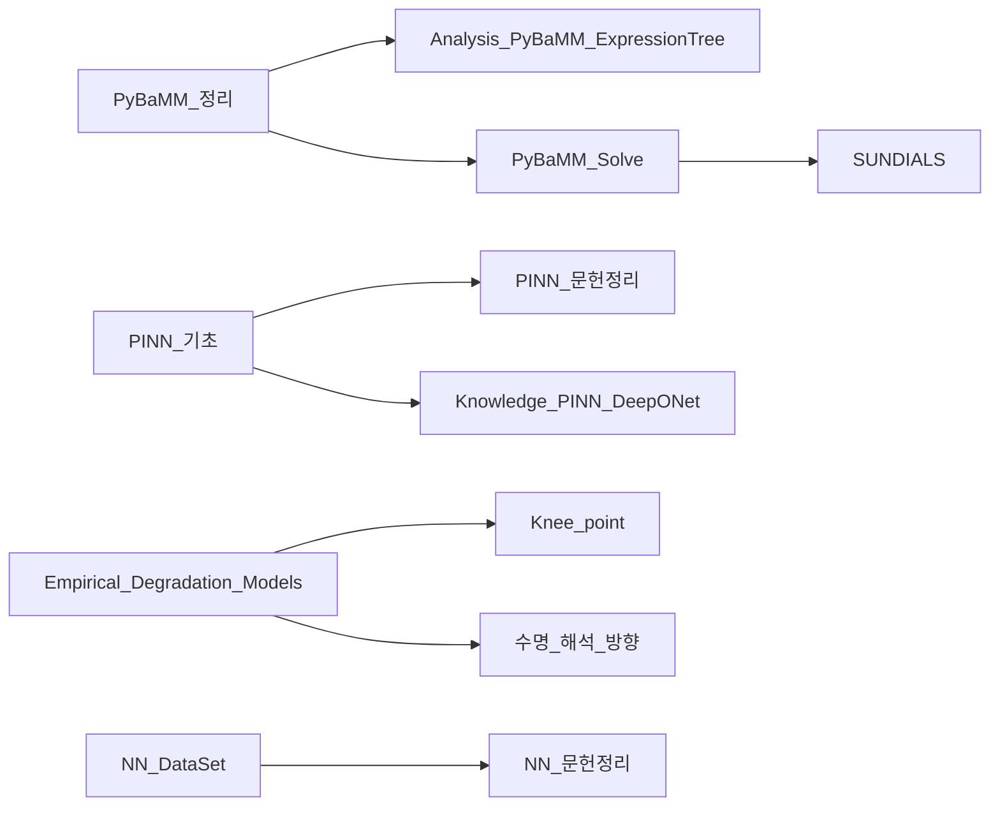

# 🧠 모델링 & AI

> [!abstract] 개요
> 배터리 수명 예측을 위한 물리기반 모델(PyBaMM·PINN)과 데이터기반 AI 모델(경험적·딥러닝)의 지식 허브.

---

## ⚛️ 물리기반 모델 (Physics-Based)

### PyBaMM
- [[PyBaMM_정리]] — 프레임워크 개요 및 아키텍처
- [[PyBaMM_Solve]] — 수치 해석 및 Solver
- [[Analysis_PyBaMM_ExpressionTree]] — Expression Tree 분석
- [[Phase1_패키지_구조_분석]] — 패키지 내부 구조
- [[SUNDIALS]] — 수치해석 솔버 (IDA, CVODES)

### PINN (Physics-Informed Neural Networks)
- [[PINN_기초]] — PINN 기본 개념
- [[PINN_문헌정리]] — 문헌 정리 및 비교
- [[Knowledge_PINN_DeepONet]] — PINN & DeepONet 심화
- [[NREL_PINN]] — NREL 연구 동향

---

## 📉 경험적 열화 모델 (Empirical)

- [[Empirical_Degradation_Models]] — Arrhenius 기반 캘린더/사이클 모델
- [[모델링_방향]] — 연구 방향 및 전략
- [[수명_해석_방향]] — 수명 해석 프레임워크
- [[Knee_point]] — Knee point 정의 및 탐지 알고리즘
- [[배터리_모델링_리뷰]] — 모델 리뷰 (ECM, ROM, 상태공간)

---

## 🤖 딥러닝 / AI

- [[Summary_AI_Tech_Stack]] — PyTorch, CNN, RNN, Transformer 스택 정리
- [[NN_DataSet]] — XJTU 데이터셋 및 벤치마크
- [[NN_문헌정리]] — RUL 예측 문헌 정리

---

## 🔗 연결망

---

## 📎 연관 카테고리
- 실험 데이터: [[02_Experiments/MOC_Experiments]]
- 전기화학 파라미터: [[03_Battery_Knowledge/Electrochemical_parameter]]
- 개발 환경: [[04_Development/MOC_Development]]
