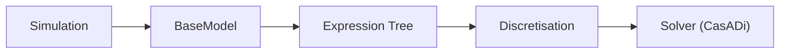
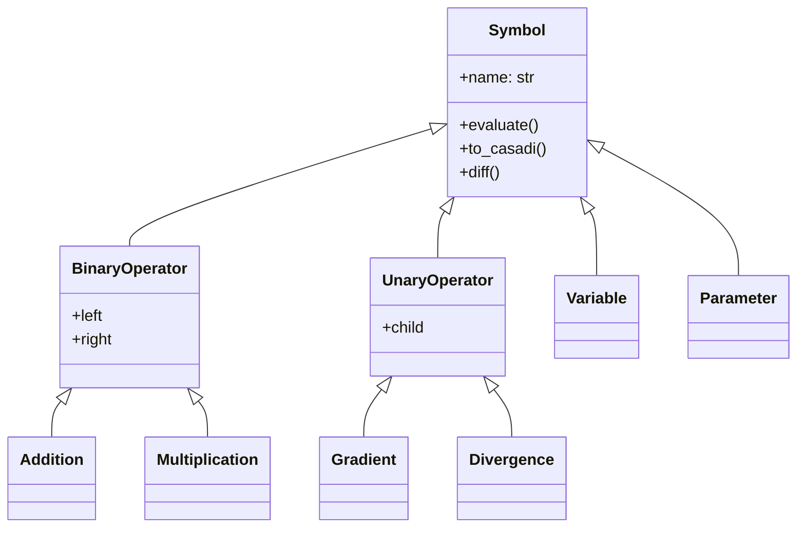

# PyBaMM Architecture: Expression Tree Analysis

## 1. 개요 (Overview)
**PyBaMM**의 코어인 **Expression Tree(식 트리)** 구조를 분석한 문서입니다. PyBaMM의 수학적 모델링이 어떻게 코드 레벨의 심볼(Symbol)로 변환되고, 다시 수치해석 솔버(CasADi 등)로 전달되는지 규명합니다.

## 2. 패키지 구조 (Package Structure)

![[Pybamm_Drawing 2025-12-18 13.38.45.excalidraw|800]]
> *그림 1: PyBaMM 아키텍처 및 데이터 흐름도*

핵심 모듈 간의 의존성 흐름은 다음과 같습니다.

### 주요 컴포넌트
- **`expression_tree/`**: 수식 표현의 핵심.
    - `symbol.py`: 기본 노드 클래스.
    - `binary_operators.py`: 덧셈, 곱셈 등 (`+`, `*`).
    - `unary_operators.py`: 미분(`grad`), 발산(`div`) 등.
- **`models/`**: DFN, SPM 등 전기화학 모델 정의.
- **`discretisations/`**: 공간 이산화 (Finite Volume Method 등).

## 3. Expression Tree 상세 분석

### 3.1 클래스 계층 (Class Hierarchy)
모든 수식 요소는 `Symbol` 클래스를 상속받습니다.

### 3.2 연산자 매핑 (Mathematical Mapping)
PyBaMM 코드가 수학적으로 어떻게 해석되는지 보여주는 테이블입니다.

| PyBaMM Code | Class Object | Mathematical Meaning |
|:--- |:--- |:--- |
| `pybamm.grad(c)` | `Gradient(c)` | $\nabla c$ |
| `pybamm.div(N)` | `Divergence(N)` | $\nabla \cdot N$ |
| `pybamm.laplacian(c)` | `Divergence(Gradient(c))` | $\nabla^2 c$ |
| `a + b` | `Addition(a, b)` | $a + b$ |
| `c.diff(t)` | `VariableDot(c)` | $\frac{\partial c}{\partial t}$ |

### 3.3 변수와 파라미터
- **`Variable`**: 미지수 (예: 농도 $c$, 전위 $\phi$). 이산화 과정을 거쳐 `StateVector`(상태 벡터 $y$)가 됩니다.
- **`Parameter`**: 상수 값 (예: 확산 계수 $D$). 입력 파라미터 딕셔너리에 의해 실수 값(Scalar)으로 치환됩니다.

## 4. 데이터 흐름 (Data Flow)

1. **Symbolic Stage**: 사용자가 `grad(c)`와 같은 수식 트리를 정의.
2. **Discretisation Stage**: 
   - `Variable` $\to$ `StateVector` ($y[0:100]$)
   - `Gradient` $\to$ 행렬 곱 ($M_{grad} @ y$)
3. **Solving Stage**:
   - `to_casadi()` 호출로 CasADi 그래프로 변환.
   - DAE/ODE 솔버가 $y$ 값을 시간 스텝별로 계산.

## 5. 결론
PyBaMM은 강력한 심볼릭 엔진을 내장하여 복잡한 편미분방정식(PDE)을 Python 객체 트리로 구성합니다. 사용자는 이산화(Discretisation)나 솔버의 복잡성을 몰라도 **물리 식 자체**에 집중하여 모델을 짤 수 있습니다.
