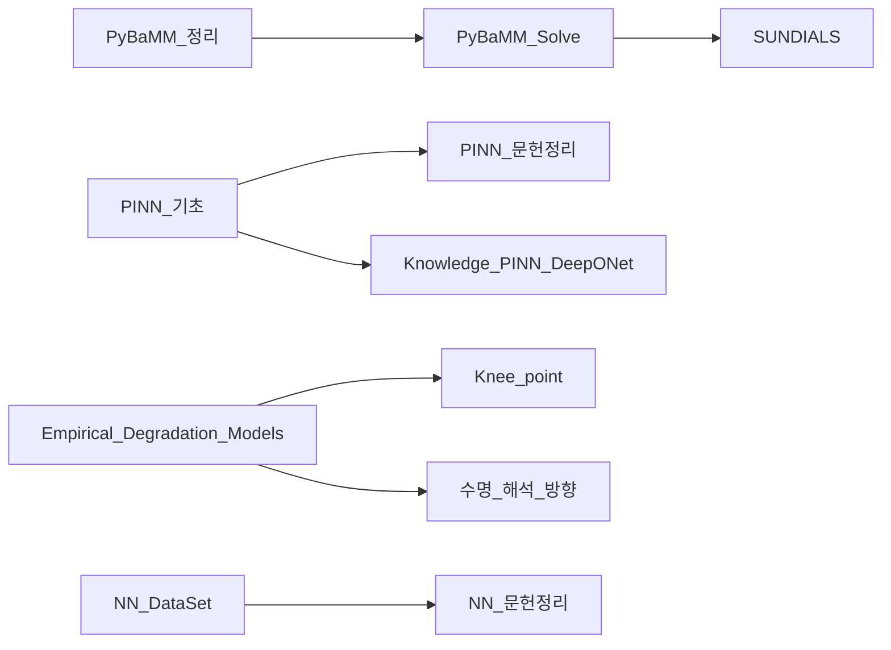

# 🧠 모델링 & AI

> [!abstract] 개요
> 배터리 수명 예측을 위한 물리기반 모델(PyBaMM·PINN)과 데이터기반 AI 모델(경험적·딥러닝)의 지식 허브.

---

## ⚛️ 물리기반 모델 (Physics-Based)

### PyBaMM
- [[PyBaMM_정리]] — 프레임워크 개요 + Expression Tree + 패키지 구조 (통합)
- [[PyBaMM_Solve]] — 수치 해석 및 Solver
- [[SUNDIALS]] — 수치해석 솔버 (IDA, CVODES)
- [[PyBaMM_Variables_PPT]] — Input ~70 + Output 510~517 전수 리스트
- [[260422_analysis_pybamm_key_parameters]] — Rate × 셀 개발 이중 관점 Key 14 + 단순화 가정 A1~A9
- [[Cell_Design_Specification_필드]] — Cell Design Spec 7대 분류 × 63 필드 스키마
- [[260422_report_cell_design_vs_pybamm]] — 개발 설계변수 × 모델링 파라미터 정리 보고서
- [[Gen5plus_ATL_문서별_설계파라미터_인덱스]] — raw/g5p_at/ 46 파일 × 설계 파라미터 매트릭스
- [[시뮬레이션_용어사전]] — 배터리그룹 용어사전 시뮬 파트 (P2D / 구조 / 열 ECM)

### PINN (Physics-Informed Neural Networks)
- [[PINN_기초]] — PINN 기본 개념
- [[PINN_문헌정리]] — 문헌 정리 및 비교
- [[Knowledge_PINN_DeepONet]] — PINN & DeepONet 심화
- [[NREL_PINN]] — NREL 연구 동향

---

## 📉 경험적 열화 모델 (Empirical)

- [[Empirical_Degradation_Models]] — Arrhenius 기반 캘린더/사이클 모델
- [[수명_해석_방향]] — 수명 해석 프레임워크 + 전반적 연구 방향 (통합)
- [[Knee_point]] — Knee point 정의 및 탐지 알고리즘
- [[배터리_모델링_리뷰]] — 모델 리뷰 (ECM, ROM, 상태공간)

---

## 🤖 딥러닝 / AI

- [[Summary_AI_Tech_Stack]] — PyTorch, CNN, RNN, Transformer 스택 정리
- [[NN_DataSet]] — XJTU 데이터셋 및 벤치마크
- [[NN_문헌정리]] — RUL 예측 문헌 정리

---

## 📦 참조 & 인프라

- [[라이브러리_구조]] — PyBaMM / 모델링 라이브러리 내부 구조
- [[모델_Figure_참고]] — 논문 그림 참고 자료
- [[Prep_Electrochemical_Modeling_Interview]] — 전기화학 모델링 인터뷰 준비
- [[pyqt6]] — PyQt6 GUI (BDT 연계)

---

## 🔗 연결망

---

## 📎 연관 카테고리
- 실험 데이터: [[MOC_Experiments]]
- 전기화학 파라미터: [[Electrochemical_parameter]]
- 개발 환경: [[MOC_Development]]

---

## 💻 BDT 코드 연계
- [[260410_analysis_library_recommendation_for_bdt|라이브러리 추천 분석]]
- [[pybamm_output_variables_260226|PyBaMM 출력 변수]]
- [[lifetime_prediction_deep_search|수명 예측 딥서치]]
