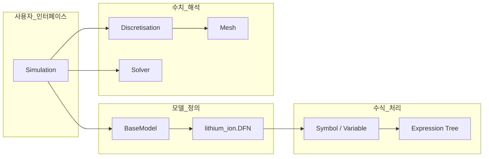
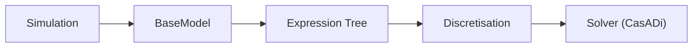
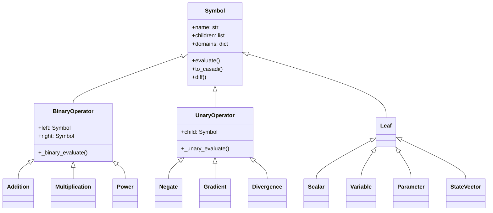
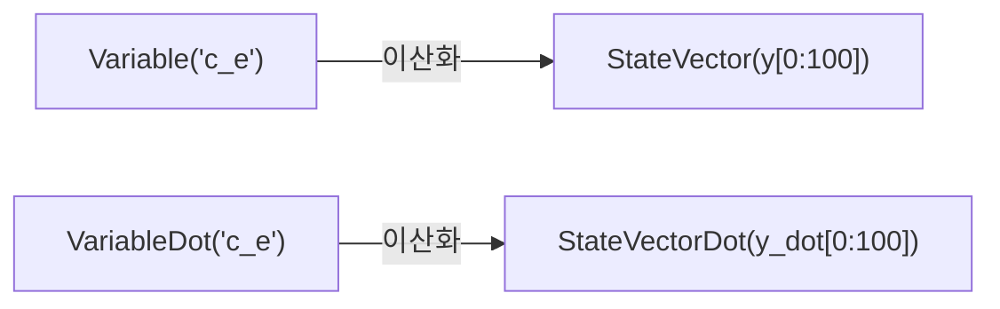
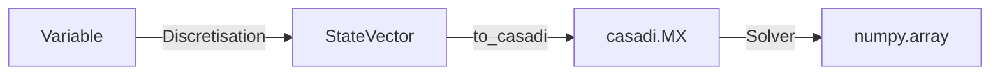
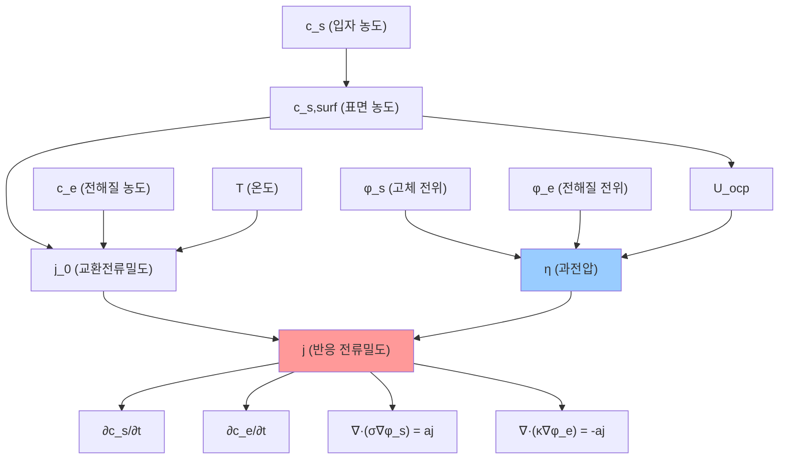

> 2026-04-21: `Analysis_PyBaMM_ExpressionTree.md`, `Phase1_패키지_구조_분석.md` 내용을 본 문서로 흡수. 솔버 상세는 [[PyBaMM_Solve]] 참조.

# 개요
## 1. 구성
1. 미분 방정식 시스템을 작성하고 풀기 위한 프레임워크
2. 배터리 모델 및 매개변수 라이브러리
3. 배터리 실험 시뮬레이션 및 결과 시각화를 위한 전문 도구

## 2. 시스템 아키텍처
- 모델 정의, 매개변수 관리, 이산화, 수치해석 솔버 등 기능별로 시스템 분리
![[Pasted image 20251218133334.png]]

### 2.1 Expression Tree System
표현 트리 시스템은 수학적 표현을 기호로 표현하여 자동적인 미분, 기호 조작, 코드 생성을 가능하게 합니다.
![[Pasted image 20251014071725.png]]

### 2.2 Battery Model System
- 리튬이온배터리 모델은 Doyle-Fuller-Newman(DFN), 단일 입자 모델(SPM_Single Particle Model) 등과 같은 물리 기반 배터리 모델을 제공
![[Pasted image 20251014070913.png]]
- *DFN(Doyle-Fuller-Newman): 전극, 전해질, 고체 및 액체 상의 반응과 물질 전달을 포함하는 모델링*
- *SPM(Single Particle Model): DFN 모델보다 단순화된 모델로, 각 전극 입자를 단일한 대표 입자로 가정하여 모델링*
- 모델별 컨셉 ![[Pasted image 20251014073259.png]]
  - https://doi.org/10.1149/1945-7111/ad8548

### 2.3 Parameter System
매개변수 시스템은 배터리별 매개변수를 관리하고 `ParameterValues`클래스를 통해 다양한 화학 물질에 대한 표준 매개변수 집합을 제공합니다. 표준화된 매개변수 공유를 위해 Battery Parameter eXchange(BPX) 형식을 지원.

### 2.4 Discretization system
이산화 시스템은 유한 체적, 스펙트럼 체적 또는 유한 요소법을 사용하여 연속 모델 방정식을 이산 수치 문제로 변환합니다.
![[Pasted image 20251014072153.png]]

![[Pasted image 20251014072229.png]]

# DFN 모델
[[DFN ]]

---

# 패키지 내부 구조

> (舊 `Phase1_패키지_구조_분석.md` 흡수 — 2026-01-12 분석)

## 1. src/pybamm 디렉토리 구조

```
src/pybamm/
├── __init__.py          # 공개 API 진입점
├── simulation.py        # 시뮬레이션 실행
│
├── expression_tree/     # 수식 표현 트리
├── models/              # 배터리 모델
├── discretisations/     # 공간 이산화
├── spatial_methods/     # 유한체적/유한요소법
├── meshes/              # 메쉬 생성
├── geometry/            # 배터리 기하학
├── solvers/             # 솔버
├── parameters/          # 파라미터 처리
├── experiment/          # 실험 프로토콜
└── plotting/            # 시각화
```

## 2. 핵심 모듈 간 의존성



## 3. `__init__.py` Import 카테고리 (256줄)

| 카테고리            |   라인    | 주요 Export                                             |
| :-------------- | :-----: | :---------------------------------------------------- |
| Utility         |  4-19   | `Timer`, `FuzzyDict`, `logger`, `settings`            |
| Expression Tree |  22-62  | `Symbol`, `Variable`, `StateVector`, `BinaryOperator` |
| Models          | 65-104  | `BaseModel`, `lithium_ion`, `lead_acid`, `sodium_ion` |
| Geometry        | 107-111 | `Geometry`, `battery_geometry`                        |
| Parameters      | 114-125 | `ParameterValues`, `LithiumIonParameters`             |
| Mesh/Disc       | 128-157 | `Mesh`, `Discretisation`, `SubMesh`                   |
| Spatial Methods | 163-169 | `FiniteVolume`, `SpectralVolume`                      |
| Solvers         | 172-189 | `CasadiSolver`, `IDAKLUSolver`, `Solution`            |
| Experiment      | 192-194 | `Experiment`, `step`                                  |
| Plotting        | 197-205 | `QuickPlot`, `dynamic_plot`                           |
| Simulation      | 208-211 | `Simulation`, `BatchStudy`                            |

### CasADi 환경 설정

```python
# Lines 222-226: CasADi 경로 자동 설정
os.environ["CASADIPATH"] = str(
    pathlib.Path(sysconfig.get_path("purelib")) / "casadi"
)
```

## 4. Expression Tree 핵심 모듈

**경로**: `src/pybamm/expression_tree/`
**구성**: 23개 모듈 + 2개 하위 디렉토리

| 모듈 | 크기 | 핵심 클래스 |
|:-----|-----:|:-----------|
| `symbol.py` | 1,157줄 | `Symbol` (기본 클래스) |
| `binary_operators.py` | 1,700줄 | `Addition`, `Multiplication`, `Power` |
| `unary_operators.py` | 1,620줄 | `Gradient`, `Divergence`, `Negate` |
| `variable.py` | 276줄 | `Variable`, `VariableDot` |
| `state_vector.py` | 392줄 | `StateVector`, `StateVectorDot` |
| `functions.py` | 622줄 | `exp`, `log`, `sin`, `cos` |
| `parameter.py` | 202줄 | `Parameter`, `FunctionParameter` |
| `scalar.py` | 114줄 | `Scalar`, `Constant` |

---

# Expression Tree 분석

> (舊 `Analysis_PyBaMM_ExpressionTree.md` 흡수)

![[Pybamm_Drawing 2025-12-18 13.38.45.excalidraw|800]]
> *그림: PyBaMM 아키텍처 및 데이터 흐름도*

## 1. 데이터 흐름 개요



## 2. 클래스 계층 구조

모든 수식 요소는 `Symbol` 클래스를 상속받습니다.



## 3. Symbol 핵심 메서드

```python
class Symbol:
    name: str                    # 심볼 이름
    children: list[Symbol]       # 자식 노드 (트리 구조)
    domains: dict                # {primary, secondary, tertiary, quaternary}
    _id: int                     # 고유 해시 ID
    scale: float                 # 스케일링 값
    reference: float             # 참조 값
```

| 메서드 | 라인 | 설명 |
|:-------|-----:|:-----|
| `evaluate(t, y, inputs)` | 823-849 | 수치 평가 |
| `to_casadi(t, y, inputs)` | 977-989 | CasADi 표현식 변환 |
| `diff(variable)` | 736-757 | 심볼릭 미분 |
| `jac(variable)` | 765-782 | 야코비안 계산 |
| `visualise(filename)` | 517-542 | PNG 트리 시각화 |

## 4. 연산자 오버로딩

```python
# Python 연산자 → PyBaMM 표현식
a + b   →  Addition(a, b)
a * b   →  Multiplication(a, b)
a ** b  →  Power(a, b)
a @ b   →  MatrixMultiplication(a, b)
-a      →  Negate(a)
abs(a)  →  AbsoluteValue(a)
a < b   →  NotEqualHeaviside(a, b)
```

## 5. BinaryOperator 야코비안

| 클래스 | 연산 | 야코비안 규칙 |
|:-------|:----:|:-------------|
| `Addition` | `+` | `∂(a+b)/∂y = ∂a/∂y + ∂b/∂y` |
| `Subtraction` | `-` | `∂(a-b)/∂y = ∂a/∂y - ∂b/∂y` |
| `Multiplication` | `*` | `∂(ab)/∂y = a·∂b/∂y + ∂a/∂y·b` |
| `Division` | `/` | `∂(a/b)/∂y = (∂a/∂y·b - a·∂b/∂y) / b²` |
| `Power` | `**` | 체인 룰 적용 |
| `MatrixMultiplication` | `@` | 행렬 곱 |

## 6. UnaryOperator (공간 연산자)

| 카테고리 | 클래스 | 수학 표현 |
|:---------|:-------|:---------|
| **기본** | `Negate` | $-x$ |
| **기본** | `AbsoluteValue` | $\|x\|$ |
| **공간** | `Gradient` | $\nabla x$ |
| **공간** | `Divergence` | $\nabla \cdot \mathbf{x}$ |
| **공간** | `Laplacian` | $\nabla^2 x$ |
| **적분** | `Integral` | $\int x \, dx$ |
| **경계** | `BoundaryValue` | $x\big|_{\text{boundary}}$ |

### 공간 연산자 수학 정의

**그래디언트** 1D: $\nabla c = \frac{\partial c}{\partial x}$, 구형: $\nabla c_s = \frac{\partial c_s}{\partial r}$

**다이버전스** 1D: $\nabla \cdot N = \frac{\partial N}{\partial x}$, 구형 Fick 확산:
$$\nabla \cdot (D \nabla c_s) = \frac{1}{r^2}\frac{\partial}{\partial r}\left(r^2 D \frac{\partial c_s}{\partial r}\right)$$

**라플라시안** 구형: $\nabla^2 c_s = \frac{1}{r^2}\frac{\partial}{\partial r}\left(r^2 \frac{\partial c_s}{\partial r}\right)$

### 적분 연산자

**x-평균** (SPM): $\bar{c} = \frac{1}{L}\int_0^L c(x) \, dx$

**r-평균** (입자 평균): $\bar{c}_s = \frac{3}{R^3}\int_0^R c_s(r) \cdot r^2 \, dr$

### 이산화 후 행렬 형태

```python
class Gradient(SpatialOperator):
    def _evaluates_on_edges(self, dimension):
        return True   # edge에서 평가 (FVM)

class Divergence(SpatialOperator):
    def _evaluates_on_edges(self, dimension):
        return False  # node에서 평가
```

| 연산자 | 연속 수식 | 이산화 형태 |
|:-------|:---------|:-----------|
| Gradient | $\nabla c$ | $G \cdot \mathbf{c}$ |
| Divergence | $\nabla \cdot N$ | $D \cdot \mathbf{N}$ |
| Laplacian | $\nabla^2 c$ | $D \cdot G \cdot \mathbf{c}$ |

## 7. Variable 클래스

```python
class VariableBase(Symbol):
    bounds: tuple          # 물리적 범위 (min, max)
    scale: float           # 스케일링
    reference: float       # 참조값

class Variable(VariableBase):
    """이산화 후 StateVector로 변환"""
    def diff(self, variable):
        if variable == pybamm.t:
            return VariableDot(...)  # 시간 미분

class VariableDot(VariableBase):
    """변수의 시간 미분 (dy/dt)"""
```



## 8. Mathematical Mapping (코드-수식 매핑)

| PyBaMM 코드 | Expression Tree | 수학 수식 |
|:------------|:----------------|:----------|
| `pybamm.grad(c)` | `Gradient(Variable("c"))` | $\nabla c$ |
| `pybamm.div(N)` | `Divergence(Variable("N"))` | $\nabla \cdot \mathbf{N}$ |
| `pybamm.div(D * pybamm.grad(c))` | `Divergence(Multiplication(...))` | $\nabla \cdot (D \nabla c)$ |
| `pybamm.laplacian(c)` | `Divergence(Gradient(...))` | $\nabla^2 c$ |
| `pybamm.Integral(c, x)` | `Integral(Variable("c"), x)` | $\int_\Omega c \, dx$ |
| `pybamm.x_average(c)` | `XAverage(Variable("c"))` | $\bar{c} = \frac{1}{L}\int_0^L c \, dx$ |
| `pybamm.r_average(c_s)` | `RAverage(Variable("c_s"))` | $\bar{c}_s = \frac{3}{R^3}\int_0^R c_s r^2 \, dr$ |
| `pybamm.surf(c_s)` | `SurfaceValue(Variable("c_s"))` | $c_s\big|_{r=R}$ |
| `pybamm.BoundaryValue(c, "left")` | `BoundaryValue(..., "left")` | $c\big|_{x=0}$ |

### 심볼릭 미분 규칙

| 표현식 | `diff(y)` 결과 | 수학 규칙 |
|:-------|:--------------|:---------|
| `Scalar(k)` | `Scalar(0)` | $\frac{d}{dy}(k) = 0$ |
| `Variable("y")` | `Scalar(1)` | $\frac{d}{dy}(y) = 1$ |
| `Addition(a, b)` | `Addition(a.diff(y), b.diff(y))` | $\frac{d}{dy}(a+b) = \frac{da}{dy} + \frac{db}{dy}$ |
| `Multiplication(a, b)` | 곱의 법칙 | $\frac{d}{dy}(ab) = a\frac{db}{dy} + \frac{da}{dy}b$ |
| `Division(a, b)` | 몫의 법칙 | $\frac{d}{dy}\left(\frac{a}{b}\right) = \frac{\frac{da}{dy}b - a\frac{db}{dy}}{b^2}$ |
| `Power(a, n)` | 체인 룰 | $\frac{d}{dy}(a^n) = na^{n-1}\frac{da}{dy}$ |
| `Exp(a)` | `Multiplication(Exp(a), a.diff(y))` | $\frac{d}{dy}(e^a) = e^a \frac{da}{dy}$ |
| `Log(a)` | `Division(a.diff(y), a)` | $\frac{d}{dy}(\ln a) = \frac{1}{a}\frac{da}{dy}$ |

## 9. 데이터 변환 흐름



1. **Symbolic Stage**: 사용자가 `grad(c)`와 같은 수식 트리를 정의
2. **Discretisation Stage**: `Variable` → `StateVector`, `Gradient` → 행렬 곱 ($M_{grad} @ y$)
3. **Solving Stage**: `to_casadi()` 호출 → CasADi 그래프 → DAE/ODE 솔버

## 10. 핵심 Variable & Parameter

| Variable | 물리적 의미 | 단위 | 도메인 |
|:-------------|:-----------|:-----|:-------|
| `c_s_n` | 음극 입자 내 리튬 농도 | mol/m³ | negative particle |
| `c_s_p` | 양극 입자 내 리튬 농도 | mol/m³ | positive particle |
| `c_e` | 전해질 리튬 이온 농도 | mol/m³ | electrolyte |
| `phi_s_n` | 음극 고체 전위 | V | negative electrode |
| `phi_s_p` | 양극 고체 전위 | V | positive electrode |
| `phi_e` | 전해질 전위 | V | electrolyte |
| `T` | 셀 온도 | K | cell |
| `j_n` | 음극 계면 전류밀도 | A/m² | negative electrode |
| `j_p` | 양극 계면 전류밀도 | A/m² | positive electrode |

| Parameter | 의미 | 단위 | 일반값 범위 |
|:--------------|:-----------|:-----|:-----------|
| `Negative electrode diffusivity [m2.s-1]` | 음극 확산 계수 | m²/s | $10^{-15}$ ~ $10^{-13}$ |
| `Positive electrode diffusivity [m2.s-1]` | 양극 확산 계수 | m²/s | $10^{-15}$ ~ $10^{-13}$ |
| `Electrolyte diffusivity [m2.s-1]` | 전해질 확산 계수 | m²/s | $10^{-11}$ ~ $10^{-9}$ |
| `Electrolyte conductivity [S.m-1]` | 전해질 이온 전도도 | S/m | 0.1 ~ 2 |
| `Negative electrode thickness [m]` | 음극 두께 | m | 50 ~ 100 μm |
| `Positive electrode thickness [m]` | 양극 두께 | m | 50 ~ 100 μm |
| `Separator thickness [m]` | 분리막 두께 | m | 10 ~ 25 μm |
| `Negative particle radius [m]` | 음극 입자 반경 | m | 2 ~ 10 μm |
| `Positive particle radius [m]` | 양극 입자 반경 | m | 2 ~ 10 μm |

### 무차원화 (Non-dimensionalization)

| 차원 변수 | 무차원화 | 스케일 |
|:---------|:--------|:-------|
| $c_s$ | $\tilde{c}_s = c_s / c_{s,max}$ | $c_{s,max}$ |
| $c_e$ | $\tilde{c}_e = c_e / c_{e,typ}$ | $c_{e,typ}$ |
| $\phi$ | $\tilde{\phi} = F\phi / (RT)$ | $RT/F$ |
| $t$ | $\tilde{t} = t / \tau$ | $\tau = L^2/D_{typ}$ |
| $x$ | $\tilde{x} = x / L$ | $L$ (셀 길이) |
| $r$ | $\tilde{r} = r / R$ | $R$ (입자 반경) |

## 11. Coupling 의존성 다이어그램



## 12. 결론

PyBaMM은 강력한 심볼릭 엔진을 내장하여 복잡한 편미분방정식(PDE)을 Python 객체 트리로 구성합니다. 사용자는 이산화(Discretisation)나 솔버의 복잡성을 몰라도 **물리 식 자체**에 집중하여 모델을 짤 수 있습니다.

---

## 관련 문서

- [[PyBaMM_Solve]] — 솔버 상세 (CasadiSolver, IDAKLUSolver)
- [[SUNDIALS]] — 수치해석 백엔드
- [[모델 Figure 참고]] (Project/Modeling)
